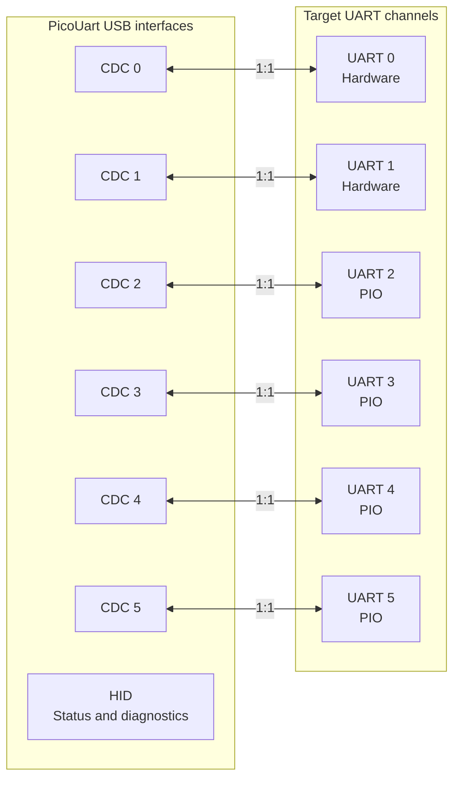

# PicoUart

[](https://github.com/djwinter29-oss/PicoUart/actions/workflows/pr-check.yml)
[](https://github.com/djwinter29-oss/PicoUart/actions/workflows/release.yml)
[](LICENSE)

**PicoUart turns an RP2040 or RP2350 device into a six-channel USB-to-UART bridge.** This embedded systems engineering
project combines composite USB firmware, hardware and PIO-based UARTs, DMA-backed data paths, HID diagnostics, and
Python, .NET, and browser-based host tools.

The project covers end-to-end embedded development, from peripheral handling and transport architecture through
runtime observability, automated testing, and gated release workflows.

## Why PicoUart

Embedded bring-up often means watching several UARTs at once: a boot log, a co-processor, and a debug console, for
example. PicoUart explores using one Pico-class MCU to expose six independent serial links over USB, with a separate HID
interface for health diagnostics. The goal is a compact, inspectable tool for multi-port development without a stack of
separate USB-UART adapters.

## At a Glance

| Interface   | Role                                                               | Implementation                    |
| ----------- | ------------------------------------------------------------------ | --------------------------------- |
| CDC0–CDC5   | Six independent host serial ports                                  | One-to-one mapping to UART0–UART5 |
| HID         | Health, overflow, version, temperature, and limited board controls | Separate from UART data           |
| UART0–UART1 | General UART traffic                                               | RP2040/RP2350 hardware UARTs      |
| UART2–UART5 | General UART traffic                                               | PIO UARTs; 8N1 only               |

### Channel Mapping

Each CDC port carries serial data for its corresponding UART. HID is a separate diagnostics and control interface; it
does not carry UART data.



### Architectural Decisions

These choices balance host compatibility, peripheral limits, concurrent transport, and verifiable release behavior.
The linked design documents describe implementation and ownership details.

| Decision | Rationale | Trade-off / Constraint | Design Reference |
| --- | --- | --- | --- |
| CDC ACM for UART data and line coding; separate HID diagnostics | Standard serial APIs and terminal tools handle UART traffic, while HID exposes health without changing UART settings. | Multiple USB interfaces and separate HID permissions; hosts must check HID health for deferred line-coding rejects. | [CDC/HID roles](docs/design/usb/cdc-hid-overview.md) |
| Two hardware UARTs plus four PIO UARTs; PIO remains 8N1 | Use the two hardware peripherals and extend channel count with PIO. Fixed 8N1 framing keeps PIO timing and implementation complexity bounded. | PIO consumes finite state-machine/instruction resources and rejects unsupported framing; it is not a full hardware-UART replacement. | [UART architecture](docs/design/uart-design.md), [PIO design](docs/design/pio-uart-design.md) |
| DMA-assisted I/O and per-channel ring buffers | Decouple UART service from USB polling with buffered data paths and explicit producer/consumer ownership. | Buffers and DMA channels are finite; overflow accounting, memory ordering, and physical timing still require careful handling and validation. | [Ring-buffer design](docs/design/ring-buffer-design.md), [Multicore ownership](docs/design/multicore-ownership-design.md) |
| Exact-artifact HIL gates before release promotion | Host tests and builds cannot prove physical UART signaling, USB behavior, or DMA/multicore timing under load. Match hardware evidence to the image being published. | Physical fixtures and board-specific runs are required; a local pass or an older artifact's result does not qualify a different release image. | [Release qualification](docs/releasing.md#release-hil-gates) |

### Host Dashboard

The optional local dashboard presents board health, traffic, and controls in one view.


_Illustrative screenshot with sample telemetry; no physical board was connected._

### Browser-Only WebHID

The [WebHID dashboard](host/webhid/README.md) provides read-only diagnostics directly in desktop Chrome or Edge,
without a Python/.NET application backend. It shows six-channel health and traffic, firmware version, temperature,
overflow counts, MCU identity, and system clock with compatible firmware.

**Connect the Pico to the computer running the browser.** WebHID accesses local USB devices; serving or forwarding the
page from another machine does not forward that machine's USB devices. Use HTTPS or localhost and approve the browser's
device chooser. OS USB permissions may still require setup. For a remotely attached Pico, use the Python/.NET dashboard.

See the [WebHID setup guide](host/webhid/README.md) and [host tools development guide](docs/development/host-tools.md#webhid-development)
for hosting, troubleshooting, and tests. The WebHID frontend is independent of the Python/.NET web UI; UART configuration,
WebSerial, and board-control writes are not included.

## Quick Start

Prebuilt firmware is available from [GitHub Releases](https://github.com/djwinter29-oss/PicoUart/releases) after a
release is published. Choose the rated `pico` or `pico2` UF2 for your board. Tagged releases remain drafts until
required HIL qualification passes. If no release is published yet, follow the
[Firmware Build and Configuration guide](firmware/build-and-config.md).

For a board with firmware installed, connect it over USB, install the host client, and read a status sample:

```sh
python -m pip install pico-uart
pico-uart status
```

Check the [UART pinout and wiring](docs/uart-pinout.md) before connecting target hardware. The
[PicoUart Python guide](host/python/README.md) covers requirements, HID access, monitoring, and the local dashboard. See
the [CDC/HID overview](docs/design/usb/cdc-hid-overview.md) for interface behavior.

## Supported Hardware

<table width="100%">
  <colgroup>
    <col width="50%" />
    <col width="50%" />
  </colgroup>
  <thead>
    <tr>
      <th align="center">RP2040 · Raspberry Pi Pico</th>
      <th align="center">RP2350 · Raspberry Pi Pico 2</th>
    </tr>
  </thead>
  <tbody>
    <tr>
      <td align="center"></td>
      <td align="center"></td>
    </tr>
    <tr>
      <td align="center"><code>--board pico</code></td>
      <td align="center"><code>--board pico2</code></td>
    </tr>
  </tbody>
</table>

_Reference boards, not PicoUart-specific assemblies. Both photos are proportionally resized and padded to a shared 640 x
400 canvas. Pico photo by Misael Reséndiz ([source](https://commons.wikimedia.org/wiki/File:Raspberry_Pi_Pico.jpg)),
licensed under [CC BY-SA 4.0](https://creativecommons.org/licenses/by-sa/4.0/); Pico 2 photo by SparkFun Electronics
([source](https://commons.wikimedia.org/wiki/File:DEV-26124-PICO-2-angle.jpg)), licensed under
[CC BY 2.0](https://creativecommons.org/licenses/by/2.0/)._

## Important Limitations

- PIO UART channels support 8N1 only; unsupported line coding is rejected.
- RTS/CTS flow control is disabled by default. Host CDC RTS is ignored, and DTR is monitored but does not gate UART
  traffic.
- Sustained multi-port throughput is limited by USB full-speed bandwidth and host drain rate.
- `cafe:4010` is a development/lab USB identity, not for commercial derivatives; see [SECURITY.md](SECURITY.md).

## Verification Evidence

The project separates automated checks, recorded target-hardware results, and release qualification gates. Hardware
records identify firmware versions and exact artifact hashes; their results apply to those images and tested conditions,
not automatically to later builds.

| Area | Evidence | Result / Scope |
| --- | --- | --- |
| Host-side C logic | [Unity/CTest suite](firmware/tests/README.md), [host CI checks](.github/workflows/host-validation.yml) | Automated logic checks; not evidence of physical DMA timing or UART signaling. |
| Python, .NET, and WebHID tooling | [Host test workflow](.github/workflows/host-validation.yml), [test commands and coverage](docs/development/host-tools.md) | pytest, xUnit, and Node checks; mocked device/browser tests do not establish native USB compatibility. |
| RP2040/RP2350 firmware builds | [Firmware build workflow](.github/workflows/pr-check.yml) | Automated target compilation and artifact verification; a successful build is not a hardware pass. |
| RP2040 / Pico hardware | [2026-10-09 v0.5.0 report](docs/tests/records/2026-10-09-070652Z-pico-hil.md) | Functional `PASS`; all-stream concurrent checks passed through 256000 baud, with higher-rate failures. Overall record: `FAIL`. |
| RP2350 / Pico 2 hardware | [2026-10-09 v0.5.0 report](docs/tests/records/2026-10-09-072834Z-pico2-hil.md) | Functional and concurrent `PASS` through the tested 3 Mbaud setting; no higher rates tested. |
| USB descriptor/version contract | [Contract tests](tests/contracts/test_firmware_contract.py), [binary artifact verifier](tools/release/verify-build.py) | Automated VID/PID, device-version, and interface/report checks; distinct from physical bus enumeration. |
| UART transport | [Pico functional results](docs/tests/records/2026-10-09-070652Z-pico-hil.md#functional-summary), [Pico 2 functional results](docs/tests/records/2026-10-09-072834Z-pico2-hil.md#functional-summary) | Recorded crossed HW/PIO links and loopbacks, with verified byte counts and per-phase results. |
| Release readiness | [Release/HIL gates](docs/releasing.md#release-hil-gates), [record requirements](docs/tests/records/README.md) | Qualification requirements, not a blanket readiness claim; exact artifacts and required board-specific HIL must match. |

See the [test evidence index](docs/tests/README.md) for test levels and `PASS` / `FAIL` / `PARTIAL` semantics, and the
[dated record archive](docs/tests/records/README.md) for retained hardware evidence, including overclock variants.
Links to automated suites and workflows describe the checks; consult the corresponding CI run logs/artifacts for
execution results. Test plans and release checklists are not substitutes for completed reports.

### Measured Six-Port Performance

Recorded 8N1 fixture results with all six streams active, using 30-second tests per rate:

| Image | Highest Passing Baud Setting | Payload Throughput Per Stream | First Failed Baud Setting |
| --- | ---: | ---: | ---: |
| Pico, 125 MHz | 256000 | 24.8-24.9 kB/s | 460800 |
| Pico, 250 MHz overclock | 921600 | 77.5-77.9 kB/s | 1000000 |
| Pico 2, 150 MHz | 3000000 | 83.4-83.7 kB/s | Not reached |
| Pico 2, 280 MHz overclock | 3000000 | 88.8-89.0 kB/s | Not reached |

Throughput is measured at each row's highest passing setting; kB/s uses 1000 bytes per second.
These are single-sweep payload-integrity results under USB-paced traffic, not guaranteed continuous UART capacity
or exact maximum baud rates. No rates above 3 Mbaud were tested. Each payload crosses USB twice, so the faster
boards' roughly 0.47-0.53 MB/s aggregate verified throughput consumes roughly twice that in combined USB payload
traffic. The plateau is consistent with USB full-speed path limits, not proof that USB alone is the bottleneck.
See [measured performance and fixture limits](docs/tests/hil-fixture-test-plan.md#measured-six-port-envelope)
for evidence and the independent UART-source testing needed to qualify sustained full-rate operation.

## Engineering Challenges Addressed

- **Limited hardware UART availability:** Combined two hardware UART peripherals with four PIO-based UART
  implementations to provide six independent channels.
- **Concurrent data movement:** Combined per-channel buffering with DMA-assisted transport to service multiple active
  channels, aiming to reduce CPU load.
- **USB composite-device complexity:** Exposed six CDC ACM interfaces and a separate HID diagnostics interface through
  one USB device.
- **Runtime diagnostics:** Added per-channel telemetry and health reporting while keeping HID diagnostics separate
  from CDC UART data and line configuration.
- **Cross-target support:** Maintained a consistent transport architecture across RP2040 and RP2350 builds.
- **Verification without permanent hardware access:** Separated host-testable logic and tooling from physical HIL
  validation; automated checks do not replace hardware qualification.
- **Release traceability:** Stamped build versions into firmware metadata, the USB device version (`bcdDevice`), and
  runtime HID reports without changing the VID/PID.

## Documentation

- [Host Python installation and usage](host/python/README.md)
- [Host .NET CLI and shared dashboard](host/dotnet/README.md)
- [Browser-only WebHID prototype](host/webhid/README.md)
- [UART pinout and wiring](docs/uart-pinout.md)
- [CDC/HID behavior](docs/design/usb/cdc-hid-overview.md)
- [HID report reference](docs/design/usb/hid-report-reference.md)
- [Hardware test index](docs/tests/README.md)
- [Release policy and qualification](docs/releasing.md)
- [Firmware development and repository testing](docs/development/firmware-testing.md)
- [Host tools development](docs/development/host-tools.md)
- [Firmware architecture](docs/architecture.md)
- [Contributing](CONTRIBUTING.md)
- [Code of Conduct](CODE_OF_CONDUCT.md)

## License

PicoUart is licensed under the [BSD 3-Clause License](LICENSE). The `cafe:4010` USB identity is for development and lab
use only; see [SECURITY.md](SECURITY.md) before building commercial derivatives.

