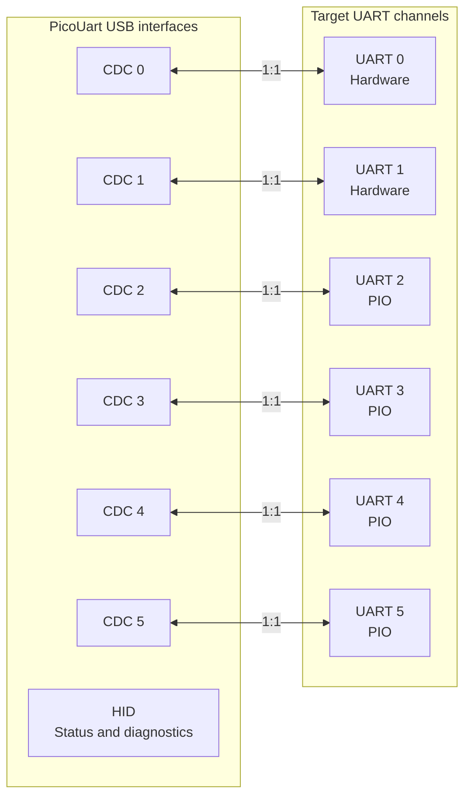
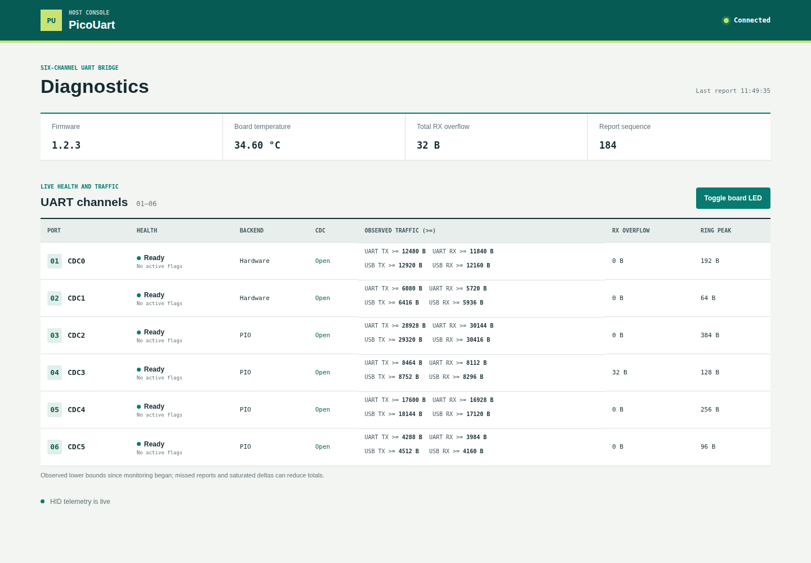
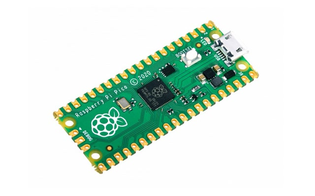
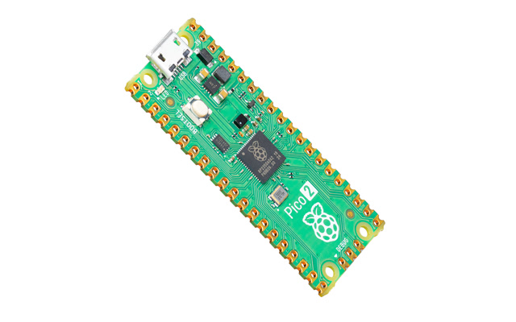

# PicoUart

PicoUart is a six-channel USB-to-UART bridge for Raspberry Pi RP2040 and RP2350 boards. Each USB CDC interface maps to
one UART channel on the target.

## Why PicoUart

Embedded bring-up often means watching several UARTs at once: a boot log, a co-processor, and a debug console, for
example. PicoUart explores using one Pico-class MCU to expose six independent serial links over USB, with a separate HID
interface for health diagnostics. The goal is a compact, inspectable tool for multi-port development without a stack of
separate USB-UART adapters.

## At a Glance

| Interface   | Role                                                               | Implementation                    |
| ----------- | ------------------------------------------------------------------ | --------------------------------- |
| CDC0–CDC5   | Six independent host serial ports                                  | One-to-one mapping to UART0–UART5 |
| HID         | Health, overflow, version, temperature, and limited board controls | Separate from UART data           |
| UART0–UART1 | General UART traffic                                               | RP2040/RP2350 hardware UARTs      |
| UART2–UART5 | General UART traffic                                               | PIO UARTs; 8N1 only               |

### Channel Mapping

Each CDC port carries serial data for its corresponding UART. HID is a separate diagnostics and control interface; it
does not carry UART data.



### Host Dashboard

The optional local dashboard presents board health, traffic, and controls in one view.



_Illustrative screenshot with sample telemetry; no physical board was connected._

## Quick Start

Prebuilt firmware is available from [GitHub Releases](https://github.com/djwinter29-oss/PicoUart/releases) after a
release is published. Choose the rated `pico` or `pico2` UF2 for your board. Tagged releases remain drafts until
required HIL qualification passes. If no release is published yet, follow the
[Firmware Build and Configuration guide](firmware/build-and-config.md).

For a board with firmware installed, connect it over USB, install the host client, and read a status sample:

```sh
python -m pip install pico-uart
pico-uart status
```

Check the [UART pinout and wiring](docs/uart-pinout.md) before connecting target hardware. The
[PicoUart Python guide](host/python/README.md) covers requirements, HID access, monitoring, and the local dashboard. See
the [CDC/HID overview](docs/usb/cdc-hid-overview.md) for interface behavior.

## Supported Hardware

<table width="100%">
  <colgroup>
    <col width="50%" />
    <col width="50%" />
  </colgroup>
  <thead>
    <tr>
      <th align="center">RP2040 · Raspberry Pi Pico</th>
      <th align="center">RP2350 · Raspberry Pi Pico 2</th>
    </tr>
  </thead>
  <tbody>
    <tr>
      <td align="center"></td>
      <td align="center"></td>
    </tr>
    <tr>
      <td align="center"><code>--board pico</code></td>
      <td align="center"><code>--board pico2</code></td>
    </tr>
  </tbody>
</table>

_Reference boards, not PicoUart-specific assemblies. Both photos are proportionally resized and padded to a shared 640 x
400 canvas. Pico photo by Misael Reséndiz ([source](https://commons.wikimedia.org/wiki/File:Raspberry_Pi_Pico.jpg)),
licensed under [CC BY-SA 4.0](https://creativecommons.org/licenses/by-sa/4.0/); Pico 2 photo by SparkFun Electronics
([source](https://commons.wikimedia.org/wiki/File:DEV-26124-PICO-2-angle.jpg)), licensed under
[CC BY 2.0](https://creativecommons.org/licenses/by/2.0/)._

## Important Limitations

- PIO UART channels support 8N1 only; unsupported line coding is rejected.
- RTS/CTS flow control is disabled by default. Host CDC RTS is ignored, and DTR is monitored but does not gate UART
  traffic.
- Sustained multi-port throughput is limited by USB full-speed bandwidth and host drain rate.
- `cafe:4010` is a development/lab USB identity, not for commercial derivatives; see [SECURITY.md](SECURITY.md).

## Documentation

- [Host Python installation and usage](host/python/README.md)
- [UART pinout and wiring](docs/uart-pinout.md)
- [CDC/HID behavior](docs/usb/cdc-hid-overview.md)
- [HID report reference](docs/usb/hid-report-reference.md)
- [Hardware test index](docs/tests/README.md)
- [Release policy and qualification](docs/releasing.md)
- [Firmware development and repository testing](docs/development/firmware-testing.md)
- [Host Python package development](docs/development/host-python.md)
- [Firmware architecture](docs/architecture.md)
