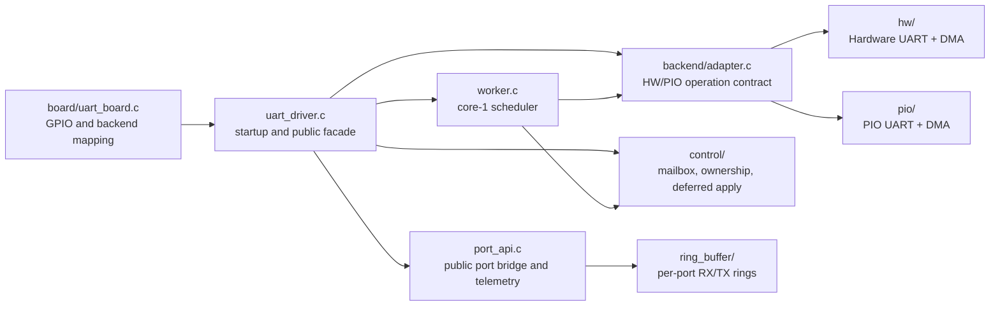
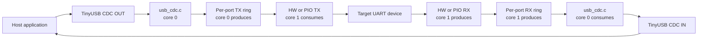
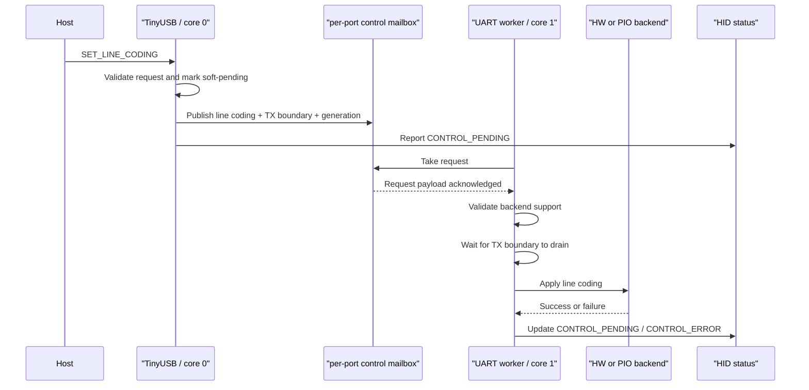

# Architecture

## Overview

PicoUart is a USB-to-UART bridge for RP2040 and RP2350.
The device presents 6 USB CDC interfaces to the host.
The device also presents 1 USB HID interface for status monitoring and
narrowly scoped board controls.
Each CDC interface maps to one UART channel.

## Runtime Ownership

Startup runs on core 0. It validates the board topology, initializes the UART
backends, starts the core-1 UART worker, and then starts the TinyUSB CDC/HID
services. After startup, ownership is split by data direction and responsibility:

- core 0 services TinyUSB and owns USB-facing bridge calls
- core 0 produces TX-ring data and consumes RX-ring data
- core 1 polls backend I/O, owns DMA/PIO steady-state service, and applies deferred line coding
- HID reads shared status and coherent telemetry snapshots
- the board layer owns physical mapping; the UART layer owns runtime behavior

The root UART facade is intentionally small in responsibility: lifecycle,
worker wiring, backend initialization, and forwarding to the private port and
control modules. The backend adapter is the only common HW/PIO dispatch point.

## Port Mapping

Each USB CDC interface maps 1:1 to one UART channel. The firmware architecture
uses 2 hardware UART backends and 4 PIO UART backends; the board GPIO allocation
is documented in [UART Pinout and Wiring](uart-pinout.md).

## Data Flow

Each USB CDC interface maps to one logical UART port. Traffic crosses the
cores through one TX ring and one RX ring per port:

Each port should work independently so traffic on one UART does not block the
others more than necessary. Hardware UART ports use DMA-backed RX and TX rings.
PIO UART ports use DMA-backed RX and a hybrid core-1 TX path: short queues use
FIFO polling, while deeper queues use a persistent TX DMA channel.

The `bridge` module provides bounded ring-to-USB operations. The `port_api`
module supplies readiness, RX/TX bridge, metadata, and telemetry operations to
the public `uart_driver_*` facade.

## Main Blocks

- USB device stack with 6 CDC ACM functions
- USB HID status-monitor function with LED-toggle, watchdog-reset, temperature, and firmware-version feature reports
- Per-port CDC-to-UART routing in the USB poll loop
- Per-port RX and TX ring buffers inside each UART backend
- 2 hardware UART backends with optional RTS/CTS backpressure
- 4 PIO UART backends
- Board-specific GPIO and peripheral mapping in `firmware/src/board/uart_board.c`
- CDC DTR is recorded for HID monitoring only and does not gate bridging; HID board controls are restricted to LED toggle and reset

## Key Behaviors

- TinyUSB is serviced from one execution context on core 0.
- UART hardware service and line-coding changes run on core 1.
- Core-to-core data movement uses per-port RX/TX rings and one control-mailbox
  slot per UART port.
- Hardware UARTs support the wider CDC line-coding set; PIO UARTs are 8N1-only
  and reject unsupported formats through HID `control_error` status.
- Flow control pins are assigned but disabled by default. See
  [UART Pinout and Wiring](uart-pinout.md) for pin ownership.
- Init claims one RX and one TX DMA channel for each of the six ports and holds
  them until deinit. That is all 12 RP2040 DMA channels. RP2350 has 16, so a
  Pico 2 build has four channels spare.
- HID reset is disabled by default and only compiled into trusted lab builds.
- The watchdog is petted from the USB poll loop only while the UART worker
  heartbeat is fresh.

## Line-Coding Control Flow

Line-coding changes use one mailbox slot per UART port and three ownership
states. A request waiting in one port's slot does not block another port from
publishing. The `CONTROL_PENDING` status bit remains asserted across those
states, so TX ingress cannot slip through the mailbox-to-worker handoff.

Older completions carry older generations and cannot clear an error belonging
to a newer host request. A worker apply also has a bounded timeout so continuous
UART traffic cannot pause USB ingress indefinitely.

## Module Responsibilities

| Module | Responsibility |
| --- | --- |
| `uart_driver.c` | Startup, backend lifecycle, worker wiring, public control forwarding |
| `port_api.c` | Public logical-port readiness, bridge, metadata, and telemetry operations |
| `backend/adapter.c` | Typed HW/PIO operation-table adapter |
| `backend/policy.h` | Shared backend policy decisions without hardware access |
| `control/` | Mailbox transport, ownership rules, deferred line-coding application |
| `bridge.c` | Bounded ring-to-USB and USB-to-ring transfers |
| `worker.c` | Core-1 scheduling and heartbeat publication |
| `hw/` | Hardware UART registers, DMA, flow control, and baud configuration |
| `pio/` | PIO programs, state machines, DMA, and PIO TX policy |
| `dma/` | Shared DMA progress/counting helpers |
| `ring_buffer/` | SPSC ring storage, reservations, overflow recovery, and snapshots |

## Detailed References

- [Overall UART Design](detail/uart-design.md) is the entry point for the
  UART facade, core ownership, rings, control plane, and HW/PIO abstraction.
- [Multicore Ownership Design](detail/multicore-ownership-design.md) defines
  ring, mailbox, lock, telemetry, and heartbeat synchronization rules.
- [Ring Buffer Design](detail/ring-buffer-design.md) covers buffer ownership,
  overflow policy, DMA interaction, and HID buffer observability.
- [PIO UART Design](detail/pio-uart-design.md) covers PIO RX/TX ownership,
  hybrid TX, and PIO line-coding limits.
- [Hardware UART Design](detail/hw-uart-design.md) covers PL011 UART DMA,
  flow control, line coding, cleanup, and hardware-specific limits.
- [Control Plane Design](detail/control-plane-design.md) covers CDC
  line-coding requests, worker mailbox ownership, and HID error reporting.
- [Backend Adapter Design](detail/backend-adapter-design.md) covers the typed
  HW/PIO operation contract, lifecycle, readiness, and line-coding dispatch.
- [CDC/HID Overview](usb/cdc-hid-overview.md) explains the relationship between the
  six CDC ports and the HID status/control interface.
- [HID Report Reference](usb/hid-report-reference.md) defines status bits,
  feature reports, and host compatibility rules.
- [Releasing PicoUart](releasing.md) defines release HIL and artifact gates.

## Known Constraints

- The compact HID report exposes high-water mark blocks and sticky overrun
  health; exact overflow counts are available through HID feature report 5.
- Sustained multi-port 1 Mbaud is bounded by USB full-speed aggregate bandwidth
  and host drain rate.
