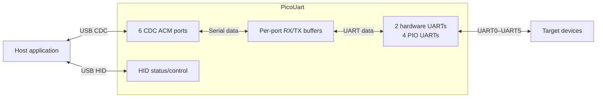

# Architecture

## System Boundary

PicoUart exposes six USB CDC ACM serial ports and one HID status/control interface. Each CDC port maps to one UART
channel. The current board configuration uses two hardware UARTs and four PIO UARTs; board-specific pin assignments
are documented in [UART Pinout and Wiring](uart-pinout.md).

```mermaid
flowchart LR
  Host["Host application"]
  subgraph Device["PicoUart"]
    CDC["6 CDC ACM ports"]
    Rings["Per-port RX/TX buffers"]
    Backends["2 hardware UARTs<br/>4 PIO UARTs"]
    HID["HID status/control"]
    CDC <-->|"Serial data"| Rings
    Rings <-->|"UART data"| Backends
  end
  Target["Target devices"]

  Host <-->|"USB CDC"| CDC
  Host <-->|"USB HID"| HID
  Backends <-->|"UART0–UART5"| Target
```

## Runtime Ownership

- Core 0 services USB and owns the host-facing bridge.
- Core 1 services UART backends and applies deferred line-coding changes.
- Per-port RX/TX buffers move data between the USB and UART sides; HID reports status separately.
- Board configuration owns pin mapping; the UART subsystem owns runtime behavior.

## Constraints

- PIO UARTs support 8N1; hardware UARTs support the broader CDC line-coding set.
- Aggregate throughput depends on USB full-speed bandwidth and host drain rate; see the
  [HIL fixture plan](tests/hil-fixture-test-plan.md) for measured results and test limits.
- Flow control is disabled by default. HID reset is disabled except in trusted lab builds; see the
  [CDC/HID overview](design/usb/cdc-hid-overview.md) for interface behavior.

## Design Details

- [UART Subsystem](design/uart/README.md) is the entry point for backend architecture, buffers, control flow, and core
  ownership. It links to the focused ring-buffer, backend, PIO, hardware UART, and multicore design documents.
- [Control Plane Design](design/control-plane-design.md) describes CDC line-coding requests and HID error reporting.
- [HID Report Reference](design/usb/hid-report-reference.md) defines report fields and host compatibility.
- [Releasing PicoUart](releasing.md) defines hardware qualification and artifact gates.
