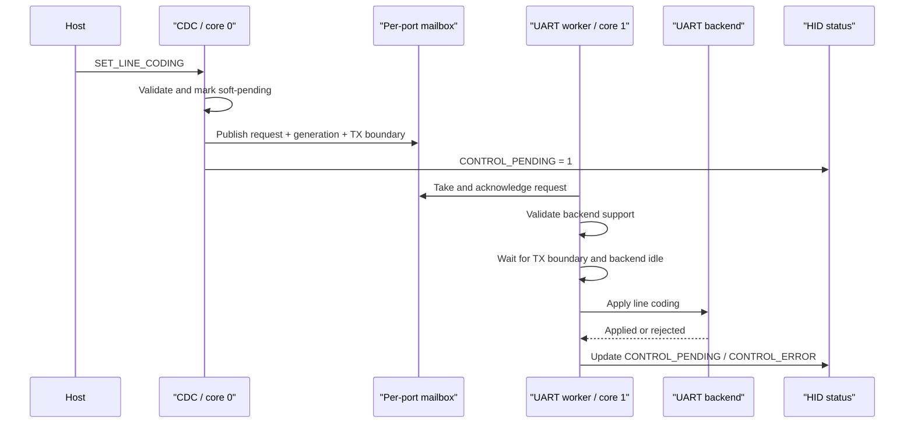

# Control Plane Design

This document describes PicoUart's UART control plane: how CDC line-coding requests move from TinyUSB on core 0 to UART
backend reconfiguration on core 1, and how failures are reported through HID health.

The data plane is documented separately in [Ring Buffer Design](uart/ring-buffer-design.md) and
[PIO UART Design](uart/pio-uart-design.md). The host-facing CDC/HID relationship is summarized in
[CDC/HID Overview](usb/cdc-hid-overview.md).

## Scope

The control plane handles CDC line-coding requests, not UART bytes. It coordinates USB-side validation with deferred
per-port backend application and reports pending or failed requests through HID. UART bytes remain on the RX/TX rings.

## Request Lifecycle

Valid requests move from USB-side pending to the per-port mailbox, then to worker ownership until the backend reaches a
safe apply boundary. Invalid or unsupported formats set `CONTROL_ERROR`. The worker applies a request only after TX has
drained to its captured boundary and backend-specific quiescence is satisfied.

Mailbox acknowledgement and worker-ownership changes must be atomic under the shared status lock. Otherwise a concurrent
reject or timeout could clear `CONTROL_PENDING` after mailbox acknowledgement but before worker ownership is visible,
allowing TX during an active format change. The worker also checks its deadline immediately before touching the backend,
so a late apply cannot report success after timeout.

CDC hosts cannot rely on the USB control transfer result alone. TinyUSB may have already completed the request before
firmware applies or rejects it. Hosts must watch HID health bit 2 (`control_error`) and bit 3 (`control_pending`).

## Ownership States

`CONTROL_PENDING` remains set while any of the soft-pending, mailbox, or worker owners remain. It blocks new TX bytes
until the captured old-format boundary is drained. Clear it only after all owners have completed; a newer reject must
not unblock TX while an older apply is still active.

## Generations and Stale Completions

Each host control request increments a per-port generation. Completions carry the generation they belong to. A
completion may update `CONTROL_ERROR` only when its generation still equals the latest generation.

This prevents a stale successful completion from clearing an error reported for a newer rejected request. It also lets
an older valid request continue applying after a newer permanent reject; the older completion is no longer allowed to
erase the newer error.

## Timeouts

Soft-pending and worker application use separate bounded per-port deadlines; one busy port does not consume another
port's timeout. Repeating the same request does not extend its deadline indefinitely, while a distinct replacement gets
a new deadline. Timeout reports `CONTROL_ERROR`; the configured duration is maintained in the control-plane
implementation.

## USB Mount and Unmount Reset

USB mount and unmount clear host-facing CDC state, cancel soft-pending requests, and reset HID scheduling and reset-arm
state. Canceled requests must not later produce timeout errors.

## Host-Visible Rules

- `SET_LINE_CODING` may look successful to the host even when firmware rejects the request later.
- `CONTROL_PENDING` means the port is waiting for mailbox or backend ownership to settle.
- `CONTROL_ERROR` means the most recent host control request failed, timed out, or was unsupported.
- Data transfer tests should include HID monitoring; clean byte transfer without clean HID health is incomplete
  evidence.

## Test Coverage

Host tests cover mailbox ownership, deadlines, stale completions, and TX blocking. They do not validate TinyUSB
lifecycle or backend quiescing; those require physical hardware. See the
[HIL fixture plan](../tests/hil-fixture-test-plan.md).
