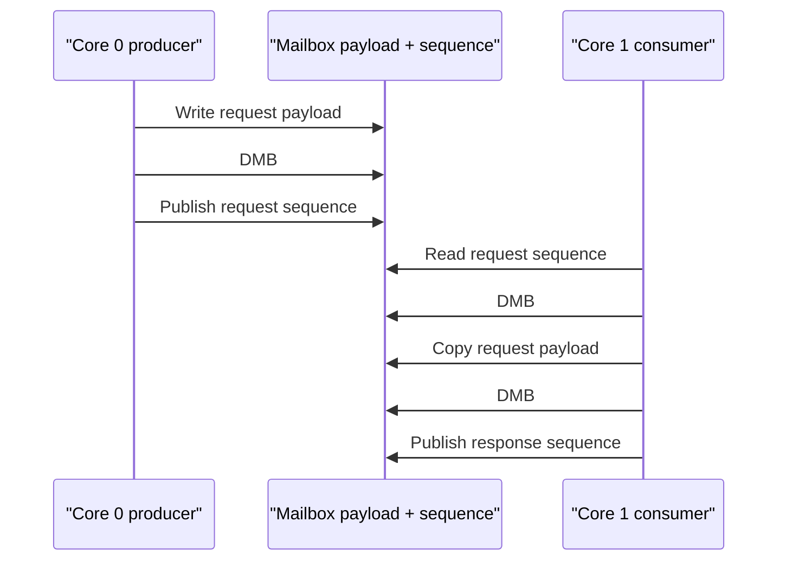

# Multicore Ownership Design

This document defines the synchronization and ownership rules between RP2040/ RP2350 core 0 and core 1. It complements
the data-path details in [Ring Buffer Design](uart/ring-buffer-design.md) and the request lifecycle in
[Control Plane Design](control-plane-design.md).

## Core Responsibilities

Core 0 exclusively owns TinyUSB and USB-side bridge work. Core 1 owns steady-state UART backend service. They
communicate through per-port rings, control mailboxes, and shared status; neither calls the other core's private
implementation.

## Ring Ownership

Per-port RX/TX direction and overflow behavior are defined in [Ring Buffer Design](uart/ring-buffer-design.md).

Aligned 32-bit cursor accesses are atomic on the supported RP2040/RP2350 platforms. Payload publication and cursor
retirement are ordered with Pico SDK `__dmb()` barriers. This is target-specific synchronization, not a portable C11
thread implementation. Ring ownership and DMA snapshot validation remain separate from status locking.

## Control Mailbox Ordering

Each UART port has its own single-producer/core-0 and single-consumer/core-1 mailbox slot. One port's unpublished
response does not block another port:

A mailbox request remains owned until the consumer publishes its matching response sequence. This ordering supports the
pending-state and TX-blocking guarantees defined in [Control Plane Design](control-plane-design.md).

## Status Lock and Generations

The status lock protects core-0-visible flags, control ownership, generations, and metadata. It does not protect ring
cursors, which use SPSC ownership and barriers; keeping the mechanisms separate prevents status reads from becoming a
global data-path lock. Per-request generation behavior is described in [Control Plane Design](control-plane-design.md).

## Telemetry Sequence Counters

Core 1 brackets each stats update with an odd/even sequence and memory barriers. Core 0 accepts a snapshot only when the
sequence is even and unchanged across the read.

## Worker Heartbeat

The worker increments a heartbeat after each complete control-and-I/O step. Core 0 observes the counter through a
barrier and feeds the watchdog only while the counter has changed within the freshness window. A stale heartbeat causes
watchdog recovery rather than allowing a wedged core-1 UART worker to run unnoticed.

## Failure and Recovery Rules

Startup rollback, control completion, and RX overflow recovery are defined in the [UART subsystem](uart/README.md),
[Control Plane Design](control-plane-design.md), and [Ring Buffer Design](uart/ring-buffer-design.md). Physical DMA,
IRQ, and multicore timing require [hardware-in-the-loop testing](../tests/hil-fixture-test-plan.md).
