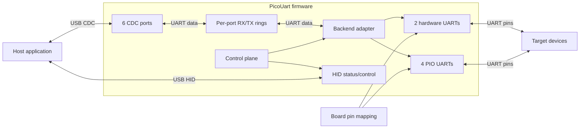

# UART Subsystem

This is the entry point for the UART subsystem. It summarizes the stable component boundaries; focused documents below
own implementation and protocol details.

## System Boundary

PicoUart exposes six USB CDC ports and one HID status/control interface. Each CDC port maps to one logical UART port.
The current board configuration uses two hardware UARTs and four PIO UARTs.

The board configuration selects the pin mapping and backend type. The UART subsystem owns runtime behavior and does not
own USB descriptors or board pin policy.

## Runtime Ownership

Core 0 services USB and performs the CDC-side bridge work. Core 1 services UART backends and applies deferred
line-coding changes. Per-port RX/TX rings carry bytes; the separate control plane carries configuration requests and
reports their status through HID.

## Constraints

- PIO UARTs support 8N1; hardware UARTs support the broader CDC line-coding set.
- Aggregate throughput depends on USB full-speed bandwidth and host drain rate; see the
    [HIL fixture plan](../../tests/hil-fixture-test-plan.md) for measured results and test limits.
- Flow control is disabled by default. Remote HID reset is disabled except in trusted lab builds; see the
    [CDC/HID Overview](../usb/cdc-hid-overview.md) for interface behavior.

## Focused Designs

- [Backend Adapter Design](backend-adapter-design.md): shared HW/PIO backend contract.
- [Hardware UART Design](hardware-uart-design.md) and [PIO UART Design](pio-uart-design.md): backend-specific behavior.
- [Control Plane Design](../control-plane-design.md): CDC line coding, deferred application, and HID error reporting.
- [Ring Buffer Design](ring-buffer-design.md) and [Multicore Ownership Design](../multicore-ownership-design.md): data
    ownership and synchronization.

For host-facing USB behavior, see the [CDC/HID Overview](../usb/cdc-hid-overview.md) and
[HID Report Reference](../usb/hid-report-reference.md). Host-test and hardware-validation boundaries are described in
the [firmware testing guide](../../development/firmware-testing.md).
