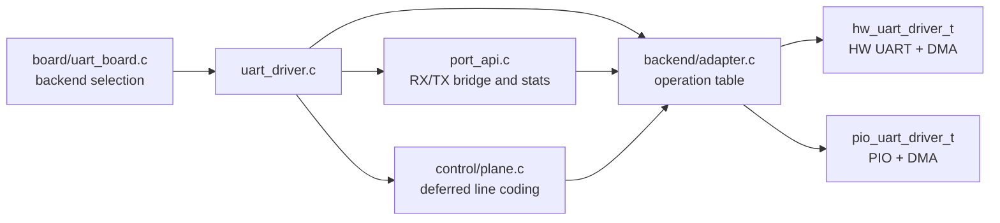
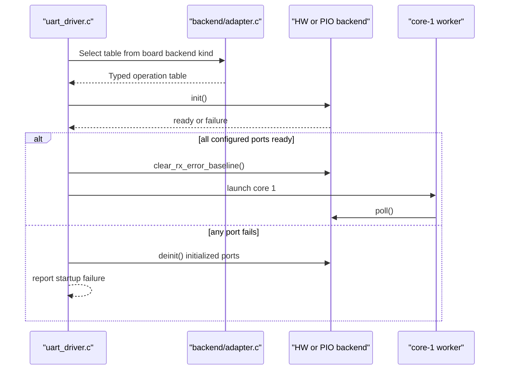

# Backend Adapter Design

## Purpose

PicoUart supports two UART implementations behind one runtime orchestration
layer:

- hardware UART with DMA under `firmware/src/uart/hw`
- PIO UART with state machines and DMA under `firmware/src/uart/pio`

The backend adapter keeps those implementations private while allowing the
worker, control plane, port facade, and telemetry code to use one contract.
The adapter is an internal UART boundary. USB and board modules should not call
it directly.

This document describes stable responsibilities and data ownership, not a
promise about private function names, callback signatures, or file-local helper
names. Those implementation details may change as long as the operation
contract and ownership rules remain intact.

## Structure

`uart_runtime_port_t` owns the public port metadata, the selected operations
table, and a tagged `uart_backend_instance_t` union containing either the HW or
PIO runtime state. The typed union makes the callback boundary explicit without
exposing backend implementation details to higher layers.

## Operation Contract

Each adapter table provides operations for:

| Operation | Responsibility |
| --- | --- |
| `is_initialized` | Report whether the concrete backend is ready for runtime use |
| `init` / `deinit` | Claim, configure, and release backend resources |
| `poll` | Advance RX DMA, TX service, framing/error checks, and backend state |
| `rx_ring` / `tx_ring` | Expose the backend-owned per-port rings to the port facade |
| `line_coding_matches` | Detect an already-active line format |
| `line_coding_acceptable` | Reject formats the backend can never support |
| `set_line_coding` | Apply a supported format after the control plane reaches a safe boundary |
| `rx_snapshot_is_current` | Validate that a copied RX span was not overwritten by live DMA |
| `clear_rx_error_baseline` | Remove startup-only receive errors from runtime telemetry |
| `baud_rate` | Return the currently active backend rate |
| `stats` | Return coherent backend transport counters |

The adapter validates that every operation is present before returning a table
to the driver. An incomplete or unknown backend selection returns `NULL` and
causes initialization to fail safely.

## Lifecycle

Initialization is all-or-nothing at the top-level driver. A failed port marks
startup unsuccessful, initialized ports are rolled back, and core 1 is not
launched. Runtime port operations also check `is_initialized` so partially
initialized or rolled-back backend storage cannot be used for ring or telemetry
access.

## Line Coding

The adapter separates permanent support from safe application:

1. `line_coding_acceptable` answers whether the backend can ever support the
   requested format.
2. The control plane captures the TX producer boundary and blocks new TX
   admission through `CONTROL_PENDING`.
3. The worker waits for the old TX boundary and backend-specific RX/TX quiescence.
4. `set_line_coding` applies the format.
5. `baud_rate` updates public metadata after successful application.

Hardware UART supports the broader validated CDC format set. PIO remains 8N1
and accepts only baud changes that are representable by its clock divider.

## Ownership Rules

- The board layer selects backend kind and static configuration.
- The top-level driver owns the runtime port table and lifecycle.
- The adapter owns only dispatch and type translation.
- Concrete HW/PIO modules own registers, DMA channels, PIO state machines, and
  backend-specific quiescing.
- The control plane and port facade may use adapter operations but do not know
  concrete backend layout.
- USB code uses only the public `uart_driver_*` API.

## Validation

Host tests cover operation-table completeness and reject incomplete tables.
Firmware builds compile and link both adapter tables with the real HW and PIO
implementations. Adapter behavior involving DMA timing, PIO FIFOs, USB traffic,
and physical UART wiring requires the documented hardware-in-the-loop tests.
