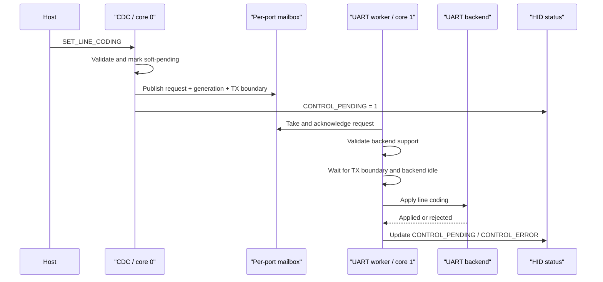
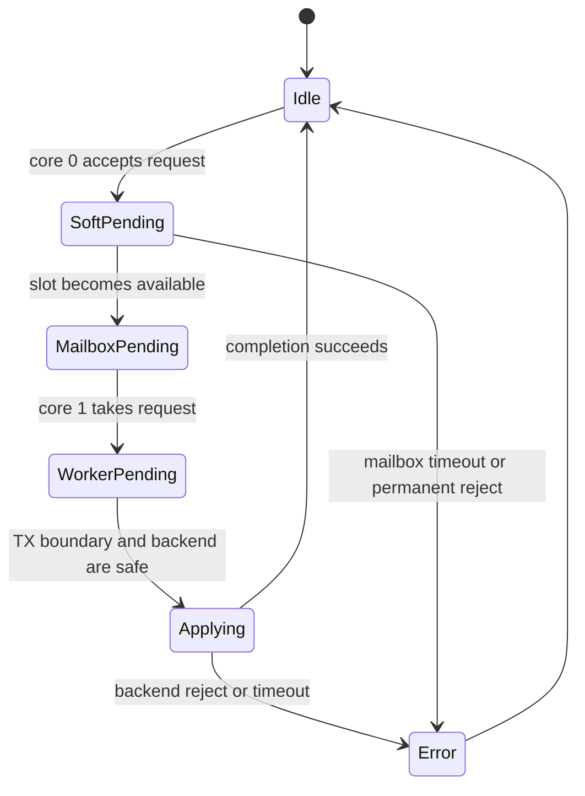
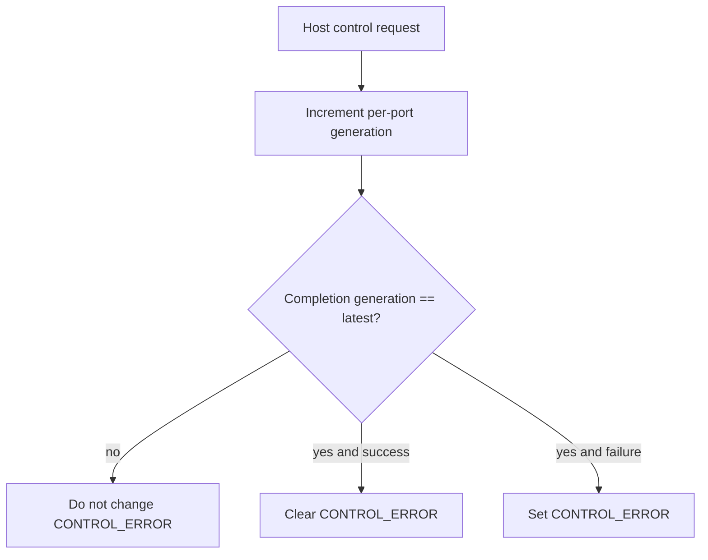

# Control Plane Design

This document describes PicoUart's UART control plane: how CDC line-coding
requests move from TinyUSB on core 0 to UART backend reconfiguration on core 1,
and how failures are reported through HID health.

The data plane is documented separately in [Ring Buffer Design](ring-buffer-design.md)
and [PIO UART Design](pio-uart-design.md). The host-facing CDC/HID relationship
is summarized in [CDC/HID Overview](../usb/cdc-hid-overview.md).

## Scope

The control plane covers:

- CDC `SET_LINE_CODING` callbacks
- soft-pending requests waiting for the worker mailbox
- one core 0 to core 1 mailbox slot per UART port
- deferred worker-side line-coding changes
- `CONTROL_PENDING` and `CONTROL_ERROR` HID health bits
- TX ingress blocking while a UART format may change
- USB mount/unmount state reset

It does not carry UART bytes; byte traffic remains on the RX/TX rings.

## Participants

| Participant | Core | Responsibility |
| --- | --- | --- |
| TinyUSB CDC callback | core 0 | Parses host line-coding requests and accepts/rejects obvious cases. |
| CDC soft-pending state | core 0 | Holds one per-port request while the worker mailbox is busy. |
| UART control mailbox | shared | Carries one request per port from core 0 to core 1. |
| UART worker | core 1 | Waits for a safe backend boundary and applies/rejects the change. |
| HID status | core 0 reads shared flags | Reports pending/error state to the host. |

## Request Lifecycle

1. TinyUSB accepts `SET_LINE_CODING` at the USB layer and calls firmware.
2. Firmware parses the CDC line-coding payload.
3. Permanent rejects, such as invalid format or unsupported PIO framing, set
   `CONTROL_ERROR` for the port.
4. Valid requests become soft-pending while core 0 waits for the worker mailbox.
5. When the mailbox is empty, core 0 publishes the request with:
   - target port
   - requested line coding
   - control generation
   - TX producer sequence boundary
6. Core 1 receives the request, validates it again, and either completes it
   immediately or holds it as worker-pending until the backend is safe to change.
7. Completion clears `CONTROL_PENDING` only if no newer owner still exists, and
   updates `CONTROL_ERROR` only if the completion generation is still current.

CDC hosts cannot rely on the USB control transfer result alone. TinyUSB may have
already completed the request before firmware applies or rejects it. Hosts must
watch HID health bit 2 (`control_error`) and bit 3 (`control_pending`).

## Ownership States

`CONTROL_PENDING` can be owned by three states:

| Owner | Meaning |
| --- | --- |
| Soft-pending | Core 0 accepted a valid host request but has not published it to the mailbox. |
| Mailbox-pending | That port's mailbox slot contains a request. |
| Worker-pending | Core 1 accepted the request and is waiting for a safe backend boundary. |

TX ingress from USB to that UART is blocked while any owner exists. This keeps
new bytes from entering the old-format TX ring after the request boundary.

A mailbox completion — invalid payload, unsupported format, or a slot whose
`port_id` does not match — clears `CONTROL_PENDING` only when soft-pending,
mailbox-pending, and worker-pending are all clear. Rejecting a newer request
must not reopen TX ingress while an older worker-pending apply is still waiting
on its TX boundary. The older apply still runs, and its completion cannot clear
`CONTROL_ERROR` belonging to the newer reject.

The worker-side boundary is the TX producer sequence captured when the mailbox
request is published. Core 1 must drain old-format bytes up to that boundary
before applying the new format.

## Generations and Stale Completions

Each host control request increments a per-port generation. Completions carry
the generation they belong to. A completion may update `CONTROL_ERROR` only when
its generation still equals the latest generation.

This prevents a stale successful completion from clearing an error reported for
a newer rejected request. It also lets an older valid request continue applying
after a newer permanent reject; the older completion is no longer allowed to
erase the newer error.

## Timeouts

Two time windows prevent indefinite stalls:

- CDC soft-pending timeout: core 0 reports `CONTROL_ERROR` if a request cannot
  enter that port's worker mailbox within 1 second. Another port's busy slot
  does not consume this window.
- Worker apply timeout: core 1 reports failure if a backend cannot reach a safe
  apply boundary within 1 second.

Identical retries do not refresh an existing deadline forever. A distinct
replacement request gets a new window.

## USB Mount and Unmount Reset

USB enumeration changes reset host-facing state:

- CDC open/DTR state is cleared.
- CDC soft-pending requests and deadlines are canceled.
- pending CDC IN flush deadlines are cleared.
- HID reset-arm state and report scheduling are reset.

Both TinyUSB mount and unmount callbacks reset this state. A canceled soft-
pending request uses a nil deadline and must not later manufacture a timeout
`CONTROL_ERROR`.

## Host-Visible Rules

- `SET_LINE_CODING` may look successful to the host even when firmware rejects
  the request later.
- `CONTROL_PENDING` means the port is waiting for mailbox or backend ownership
  to settle.
- `CONTROL_ERROR` means the most recent host control request failed, timed out,
  or was unsupported.
- Data transfer tests should include HID monitoring; clean byte transfer without
  clean HID health is incomplete evidence.

## Test Coverage

Host unit tests cover the pure ownership rules in `ownership.h` and
`cdc_soft_pending.h`:

- deadline refresh policy for identical versus replacement requests
- nil-deadline cancellation after reset
- mailbox sequence wrap behavior
- independent per-port mailbox slots
- stale completion generation checks
- TX blocking while any control owner is active

End-to-end USB lifecycle and backend quiescing still require hardware-in-the-
loop validation because the real path crosses TinyUSB callbacks, shared UART
state, core 1 worker timing, and physical USB re-enumeration.