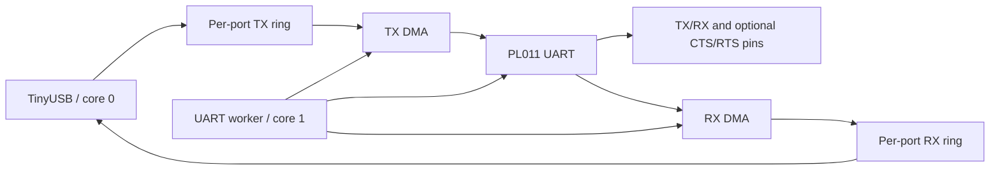
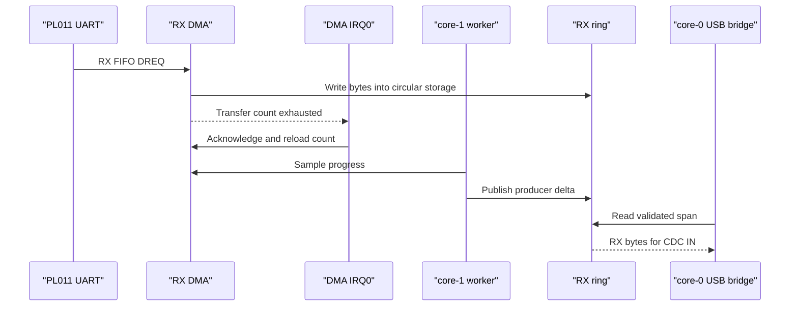
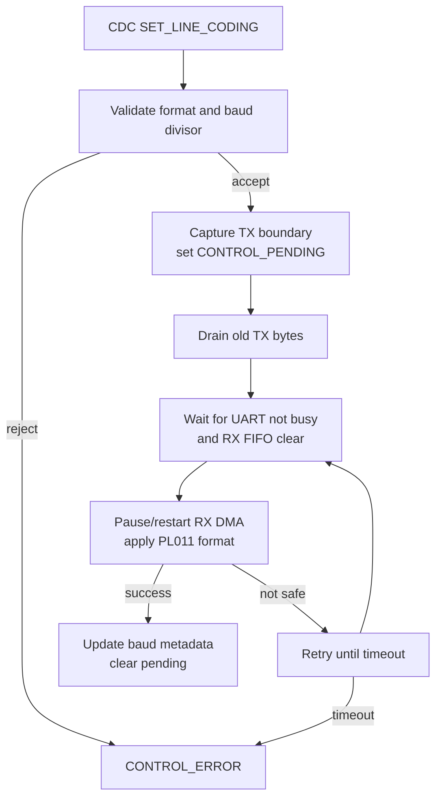

# Hardware UART Design

This document describes the hardware UART backend used for the two logical
ports mapped to RP2040/RP2350 UART peripherals. Shared adapter behavior is
covered by [Backend Adapter Design](backend-adapter-design.md); generic ring
ownership is covered by [Ring Buffer Design](ring-buffer-design.md).

## Ownership

- Core 0 owns TinyUSB and copies CDC data to and from the per-port rings.
- Core 1 owns hardware UART registers, RX/TX DMA, flow-control GPIO behavior,
  and deferred line-coding application.
- The hardware backend never calls TinyUSB directly.

## Initialization

`hw_uart_driver_init()` validates the peripheral, pins, and optional flow-
control configuration before claiming resources. It then:

1. initializes the RX and TX rings
2. claims one RX DMA channel and one TX DMA channel and holds both until deinit
3. assigns UART GPIO functions
4. configures the PL011 baud rate, format, FIFO, and optional CTS
5. configures RTS policy when hardware flow control is enabled
6. starts the circular RX DMA transfer
7. marks the backend initialized

DMA claim failure is reported without panicking. Previously claimed resources
are released by the claim/rollback path. The top-level UART driver rolls back
all initialized ports if any configured port fails startup and does not launch
core 1.

The shipped six-port map claims 12 DMA channels (RX and TX on every port) and
holds them for the life of the firmware. RP2040 has 12 DMA channels, so a Pico
build has none spare: another DMA user fails init. RP2350 has 16 channels.
An unsupported baud in `hw_uart_driver_configure_uart()` returns false. Init
releases the port's DMA channels. A runtime line-format apply that fails after
the peripheral was stopped restores the previous format instead of panicking.

## RX Path

RX uses a circular DMA transfer from the UART data register into the aligned
per-port RX storage. The backend tracks the current DMA progress and publishes
the produced-byte delta into the RX ring sequence.

DMA transfer completion is re-armed through the shared DMA IRQ handler. The
worker poll path also checks for an exhausted, idle channel as a safety net if
the IRQ is delayed or masked.

RX snapshot validation compares the copied consumer reservation with live DMA
progress. If DMA has overwritten the reserved span, the bridge rejects the
stale snapshot and ring recovery accounts for the loss.

## TX Path

USB-to-UART data enters the TX ring on core 0. The worker launches a bounded TX
DMA span when the UART is idle and no control transition blocks new TX. On DMA
completion, the backend commits exactly the bytes owned by that transfer and
may launch the next span.

Each launch is bounded by:

- contiguous ring availability
- the configured maximum span
- a conservative wire-time budget based on baud and frame width

This prevents one busy hardware UART from monopolizing the worker loop.

## Hardware Flow Control

Hardware RTS/CTS is opt-in through the board configuration. When enabled:

- CTS is configured as active-low UART flow control
- RTS is driven through a SIO GPIO output
- RTS uses occupancy hysteresis
- RTS deasserts when RX occupancy reaches the high watermark
- RTS reasserts after occupancy falls to the low watermark

The default board configuration keeps hardware flow control disabled. Pin
assignment alone does not advertise a lossless flow-control guarantee.

## Baud Rate and Line Coding

The adapter checks PL011 divisor representability and rejects rates exceeding
the configured error tolerance. Supported data bits, stop bits, and parity are
validated before application.

A line-coding change is not applied immediately from the USB callback. The
control plane captures a TX producer boundary, blocks new TX admission through
`CONTROL_PENDING`, and asks the worker to apply the change after the old TX
boundary and hardware idle conditions are safe.

Before reconfiguration, RX DMA is paused and its progress is published. The
backend then applies the full line format and restarts RX DMA at the live ring
producer position so unread RX data is preserved.

## Deinitialization and Error Baseline

Deinitialization disables the RX DMA IRQ channel, removes the IRQ owner entry,
aborts active DMA, acknowledges pending IRQ state, unclaims both channels, and
deinitializes the UART peripheral. GPIO functions are released by the backend
cleanup path.

After successful startup, the top-level driver clears receive-status errors
collected during bring-up. Runtime framing and receive-status errors then remain
visible through backend statistics and HID health reporting.

## Limits and Validation

- Hardware UART line coding depends on PL011 divisor precision and the configured
  baud error tolerance.
- RX overflow remains possible when the peer ignores RTS or the host does not
  drain CDC IN quickly enough.
- DMA, IRQ timing, UART idle behavior, and RTS/CTS behavior require HIL testing.
- Host tests cover pure baud/policy and resource-claim logic; the real backend
  path is validated by firmware builds and the documented hardware test plans.
