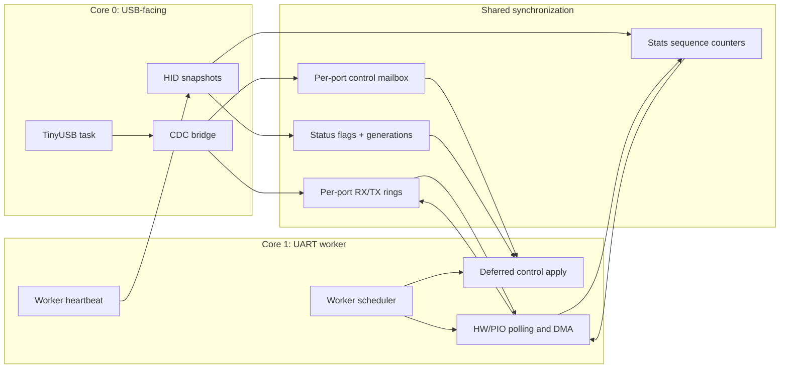
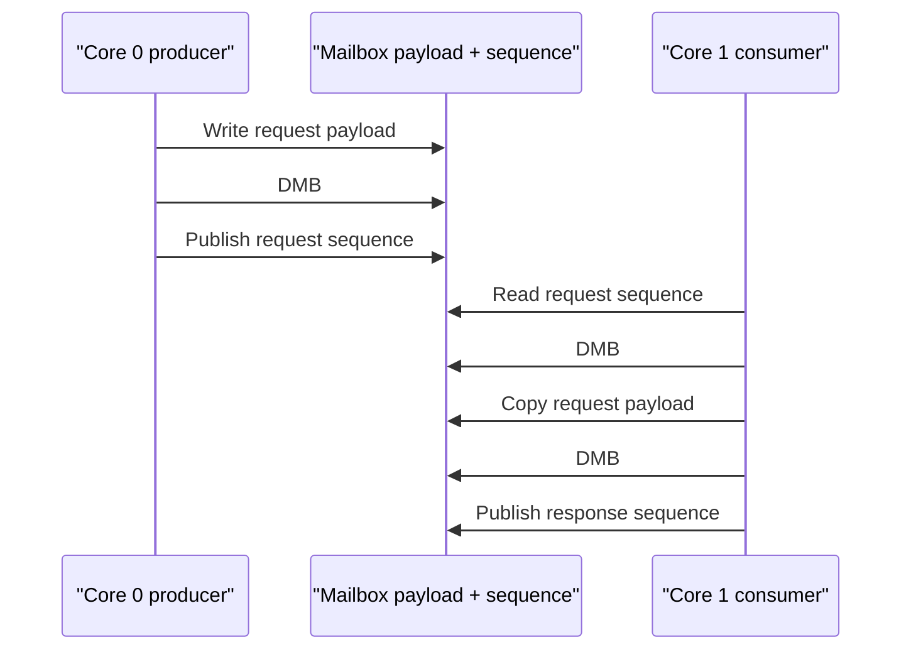
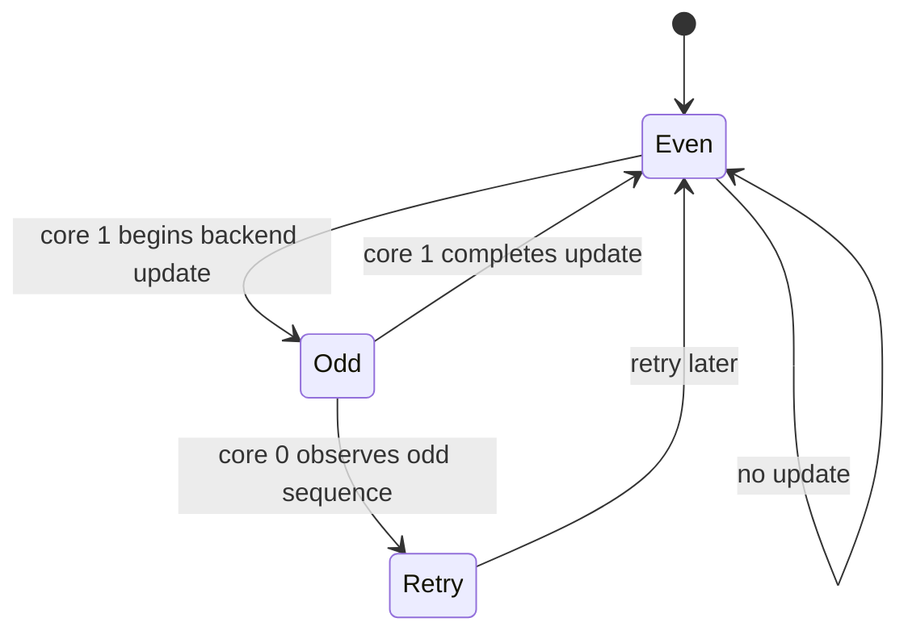

# Multicore Ownership Design

This document defines the synchronization and ownership rules between RP2040/
RP2350 core 0 and core 1. It complements the data-path details in [Ring Buffer
Design](ring-buffer-design.md) and the request lifecycle in [Control Plane
Design](control-plane-design.md).

## Core Responsibilities

Core 0 is the only TinyUSB owner. Core 1 is the only steady-state UART backend
owner. Neither core calls the other core's private implementation directly.

## Ring Ownership

Each logical port has two SPSC rings:

| Ring | Producer | Consumer | Synchronization |
| --- | --- | --- | --- |
| TX | core-0 CDC bridge | core-1 backend | producer/consumer sequences + DMB |
| RX | core-1 backend/DMA | core-0 CDC bridge | producer/consumer sequences + DMB |

Aligned 32-bit cursor accesses are atomic on the supported RP2040/RP2350
platforms. Payload publication and cursor retirement are ordered with Pico SDK
`__dmb()` barriers. This is target-specific synchronization, not a portable
C11 thread implementation.

The RX bridge copies a reserved span to a private snapshot before delivering it
to USB. It validates both the ring reservation and live DMA progress before
committing the copied bytes.

## Control Mailbox Ordering

Each UART port has its own single-producer/core-0 and single-consumer/core-1
mailbox slot. One port's unpublished response does not block another port:

A mailbox request is considered owned until the consumer publishes the matching
response sequence. `CONTROL_PENDING` remains asserted while a request moves
through soft-pending, mailbox-pending, and worker-pending states so TX admission
cannot slip through the handoff.

## Status Lock and Generations

The status lock protects core-0-visible control state:

- per-port status flags
- soft-pending ownership
- control generations
- metadata updates such as the active baud rate

Each host control request receives a per-port generation. A completion may change
`CONTROL_ERROR` only when its generation is still the latest generation. This
prevents a stale worker result from erasing a newer host-visible failure.

The lock does not protect ring cursors. Ring cursors use the SPSC ownership
model and barriers instead. Keeping these synchronization mechanisms separate
prevents a USB status read from becoming a global UART data-path lock.

## Telemetry Sequence Counters

Each port has a worker-published stats sequence counter:

Core 1 increments the sequence to an odd value before polling a backend and to
an even value after the update, with barriers around the transitions. Core 0
accepts a telemetry snapshot only when the sequence is even and unchanged before
and after reading the rings and backend counters.

## Worker Heartbeat

The worker increments a heartbeat after each complete control-and-I/O step.
Core 0 observes the counter through a barrier and feeds the watchdog only while
the counter has changed within the freshness window. A stale heartbeat causes
watchdog recovery rather than allowing a wedged core-1 UART worker to run
unnoticed.

## Failure and Recovery Rules

- A backend initialization failure rolls back initialized ports before core 1 launches.
- A worker control timeout reports `CONTROL_ERROR` and clears worker ownership.
- A USB mount/unmount reset clears only core-0 soft-pending state; mailbox- and worker-owned changes remain under core-1 completion rules.
- RX overflow recovery advances the consumer and records loss; it never lets the producer rewrite the consumer cursor.
- Physical DMA, IRQ, and multicore timing behavior requires HIL validation.
