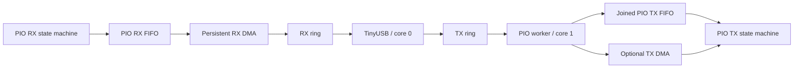
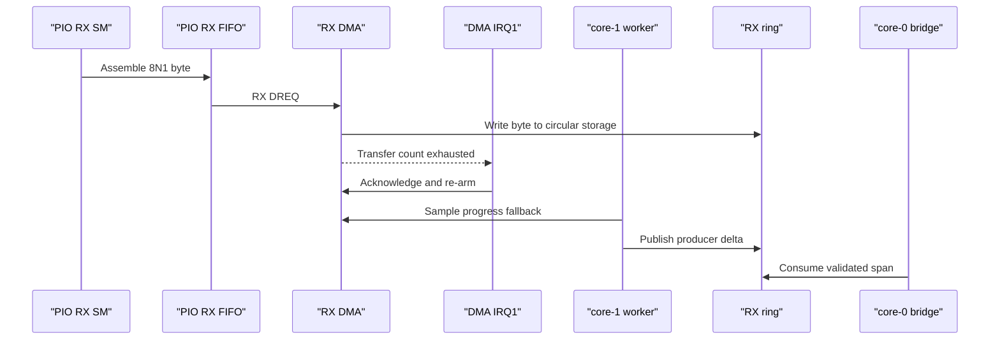
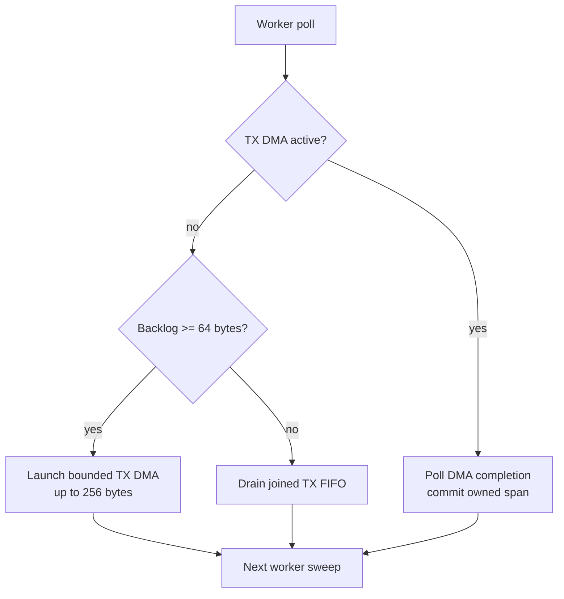
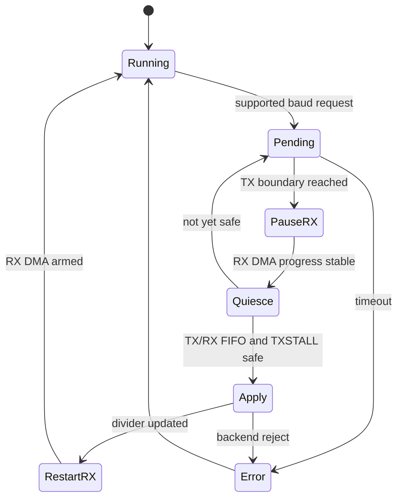

# PIO UART Design

This document describes the PIO UART backend used for logical UART ports 2-5.
It focuses on the current runtime design: core ownership, RX DMA, hybrid TX,
flow-control hooks, and safe baud-rate changes.

For shared ring semantics, see [Ring Buffer Design](ring-buffer-design.md). For
host-visible status bits, see [HID Report Reference](../usb/hid-report-reference.md).

## Ownership Model

- Core 0 owns TinyUSB and moves bytes between CDC endpoints and per-port rings.
- Core 1 owns PIO state machines, DMA channels, TX/RX service, and backend
  control changes.
- RX and TX rings are the only data-plane contract between USB code and the PIO
  backend.

This keeps TinyUSB isolated from hardware service details and preserves one
producer and one consumer for each ring direction.

## RX Path

PIO RX is DMA-backed. Each PIO RX state machine assembles UART bytes into its RX
FIFO, and a persistent DMA channel writes those bytes into the matching RX ring.
Core 1 publishes DMA progress into the ring producer sequence and re-arms the RX
DMA transfer when needed.

Important details:

- The PIO RX program uses a 3-sample majority vote on every bit (8 data bits
  plus the stop bit) at its own 22 PIO clocks/bit ratio, independent of TX's
  8 clocks/bit divider; RX and TX run on separate state machines with
  separate clock dividers, so this does not change TX bit timing. See the
  cycle derivation and majority-vote rationale in `uart.pio`.
- The IN shift is configured so LSB-first UART samples form a natural byte in
  FIFO bits `[31:24]`; RX DMA reads one byte from `rxf+3`.
- RX DMA transfer counts use the SDK encoder so RP2350 does not enter ENDLESS
  mode.
- Stop-bit framing errors are sticky per port and visible as HID health bit 7.
- If the host does not drain CDC fast enough, shared ring overflow accounting
  records overwritten RX bytes.

RX DMA re-arm is handled from DMA IRQ1 on the UART worker core, with the worker
poll path as a safety net.

## TX Path

PIO TX is hybrid. Core 1 chooses one action per port during each worker poll:

1. If TX DMA is active, poll for completion and commit the owned ring span.
2. If TX DMA is idle and backlog is large enough, launch a bounded DMA transfer.
3. Otherwise, drain bytes directly into the joined PIO TX FIFO from the poll
   loop.

The default thresholds keep small writes cheap while avoiding excessive CPU work
for deeper queues:

| Setting | Default | Purpose |
| --- | ---: | --- |
| DMA start threshold | 64 bytes | Minimum TX backlog before DMA is preferred. |
| DMA max transfer | 256 bytes | Bound one DMA launch so a port cannot monopolize the worker. |

Each initialized PIO port claims its TX DMA channel once during init and holds
that channel until deinit. A launch reuses the claimed channel; it does not
claim or release a channel per transfer. If that launch does not start, the
same sweep drains the FIFO instead. While TX DMA is active, it owns exactly
`tx_dma_bytes_in_flight` bytes from the TX ring; those bytes are committed only
after DMA completion. The channel stays claimed.

## Why TX Is Hybrid

The joined PIO TX FIFO is small compared with sustained USB-originated bursts
across multiple ports. Pure polling wastes worker time under backlog, but pure
DMA wastes setup cost on tiny writes. The hybrid policy keeps short bursts
simple and uses DMA only when queued work is large enough to amortize setup.

## Flow-Control Pins

PIO RTS/CTS support is opt-in through board pin flags:

| Flag | Behavior |
| --- | --- |
| `PIO_UART_DRIVER_PIN_FLAG_RX_FLOW_CONTROL` | Drives the configured active-low RTS pin from RX-ring occupancy. |
| `PIO_UART_DRIVER_PIN_FLAG_TX_FLOW_CONTROL` | Gates TX frame starts on the configured active-low CTS pin. The CTS program holds the stop bit for 7 PIO clocks and lets the following `wait` supply the 8th clock when CTS is already granted. |
| `PIO_UART_DRIVER_PIN_FLAG_RX_PULL_UP` | Enables a pull-up on the RX pin during backend init. |
| `PIO_UART_DRIVER_PIN_FLAG_REQUIRE_RX_IDLE_HIGH` | Requires idle-high RX before applying a deferred baud change. |

The default board configuration leaves PIO RTS/CTS disabled. Do not claim
lossless RX behavior without testing the relevant flow-control variant.

## Line-Coding Changes

PIO UART ports remain 8N1-only. Unsupported parity, data-bit, or stop-bit
requests are rejected and reported through HID `control_error`. Supported baud
changes are deferred until the worker core can reach a safe boundary.

Before applying a PIO baud change, core 1:

1. Pauses new USB-to-UART writes for that port through shared control-pending
   state.
2. Publishes pending RX DMA progress into the RX ring.
3. Pauses RX DMA, waits for a stable transfer count, then aborts and acknowledges
   the DMA channel inside a short critical section.
4. Waits for TX DMA completion, an empty TX ring, an empty TX FIFO, and TXSTALL
   re-assertion after write-clear.
5. Requires an empty RX FIFO, and for shipped ports also requires idle-high RX.
6. Applies the baud change and restarts RX DMA. If the port is not yet safe, the
   worker retries on a later sweep.

The TXSTALL wait is based on a few PIO cycles at the current baud, with a small
microsecond floor, rather than a fixed CPU-iteration loop. The RX idle-high gate
prevents changing the divider mid-frame for boards that can guarantee idle-high
RX through pull-up.

## Observability

The backend tracks TX bytes sent through polling and DMA. The compact HID input
report exposes aggregate controller TX/RX byte deltas and per-channel health;
it does not distinguish PIO poll TX from PIO DMA TX.

Relevant host-visible signals:

- HID health bit 2: control request failed or timed out.
- HID health bit 3: control request is pending.
- HID health bit 5: backend is PIO.
- HID health bit 6: RX data has been overwritten.
- HID health bit 7: PIO stop-bit framing error. Startup calls
  `clear_rx_error_baseline` after every backend is up and before core 1 polls.
  That hook clears a sticky RX stop-bit interrupt without counting it, so pin
  bring-up noise does not stick as a false framing fault.
- HID overflow-count feature report: cumulative UART-to-USB RX dropped bytes.

## Current Limits

- PIO UART framing is 8N1 only.
- PIO baud rates must be representable by both the TX and RX PIO clock
  dividers and are rejected fail-fast otherwise; RX's 22x ratio is the
  stricter of the two at very low baud rates.
- The RX program is 23 instructions (TX is 4, TX_CTS is 5). On the shipped
  board (no port ever enables CTS) a PIO block holds TX + RX = 27/32
  instructions. A hypothetical future block mixing a CTS port with a
  plain-TX port and RX would need 4 + 5 + 23 = 32/32, the hard RP2040
  instruction-memory ceiling with zero spare room; `pio_can_add_program()`
  still fails fast rather than silently overflowing if that configuration is
  ever attempted.
- TX DMA thresholds are static defaults, not adaptive to live load.
- Each worker step services every port. Deferred control and backend polling
  start on the same port in that step. The shared start index advances once,
  after the I/O sweep. There is no separate TX priority scheduler.
- Sustained multi-port 1 Mbaud remains bounded by USB full-speed aggregate
  bandwidth and host drain rate.

## Follow-Up Options

1. Tune TX DMA threshold and max transfer size from measured worker load and
   end-to-end latency.
2. Add an explicit worker-side TX scheduler if multiple PIO ports sustain high
   TX pressure at the same time.
3. Add dedicated HIL coverage for PIO RTS/CTS hold/release behavior before
   advertising flow-control guarantees.