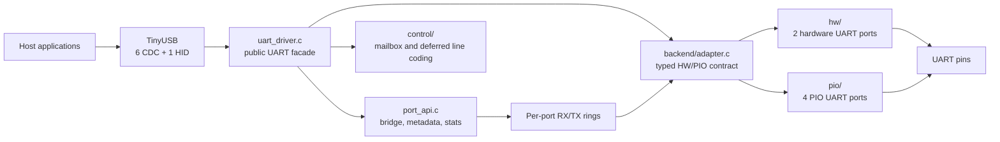
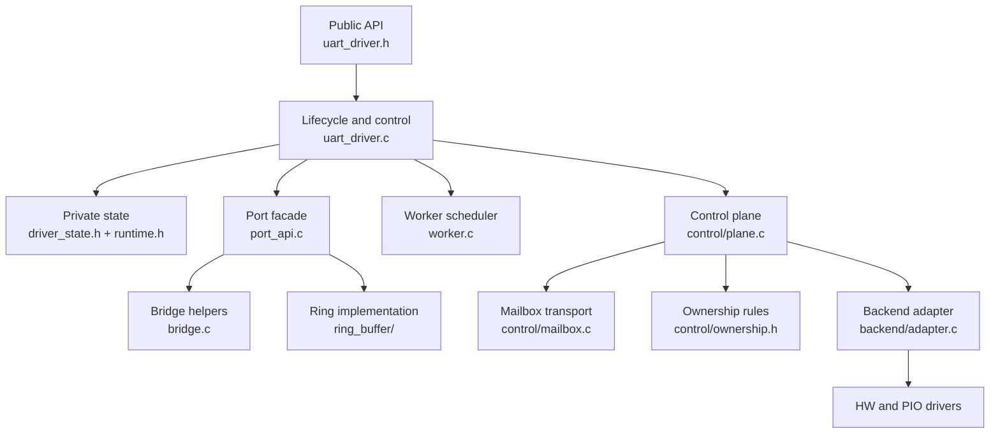
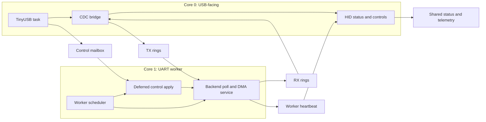
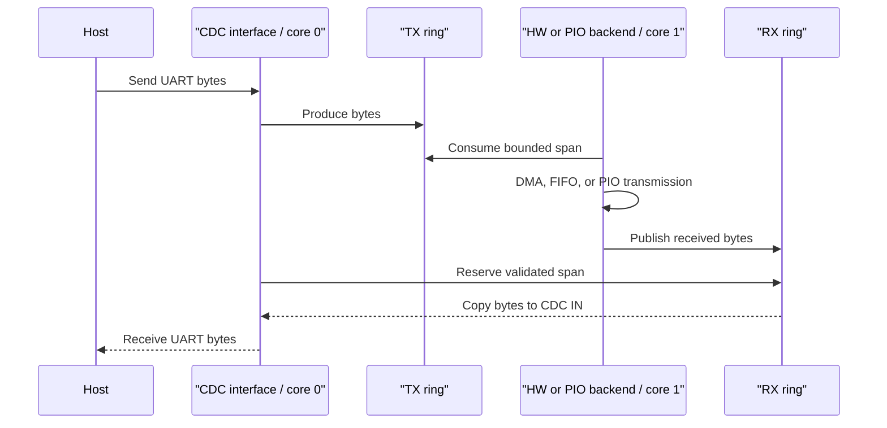
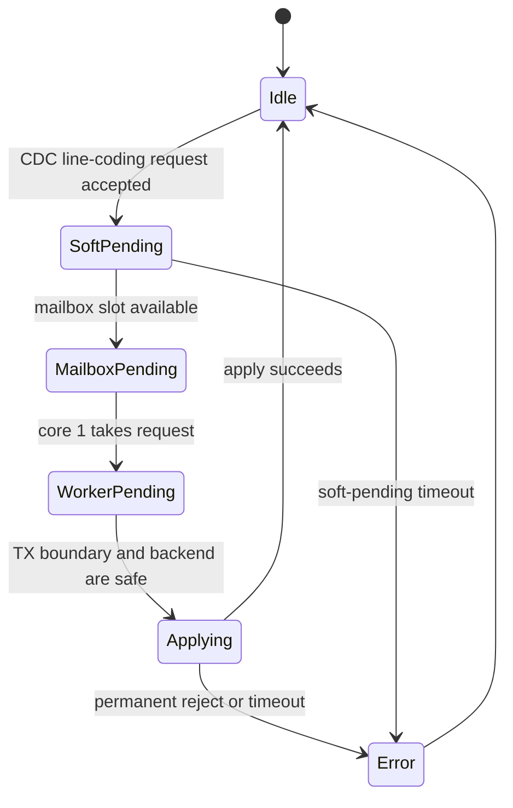

# UART Design

This document is the overall design entry point for the UART subsystem. It
explains how the public UART facade, port API, control plane, backend adapter,
and concrete hardware implementations fit together.

The diagrams and module names describe architectural responsibilities. Private
helper names and callback signatures are implementation details and may change
without requiring an architectural rewrite of this document.

Detailed behavior is split into focused documents:

- [Backend Adapter Design](backend-adapter-design.md)
- [Hardware UART Design](hw-uart-design.md)
- [PIO UART Design](pio-uart-design.md)
- [Control Plane Design](control-plane-design.md)
- [Ring Buffer Design](ring-buffer-design.md)
- [Multicore Ownership Design](multicore-ownership-design.md)

## System Boundary

PicoUart exposes six USB CDC ports and one HID status/control interface. Each
CDC port maps to one logical UART port. The current board configuration uses
two hardware UART backends and four PIO UART backends.

The board layer selects the physical mapping and backend kind. The UART layer
owns runtime behavior and does not own USB descriptors or board pin policy.

## Module Layers

The adapter is the only common HW/PIO dispatch point. USB code uses the public
`uart_driver_*` API and never accesses backend instances directly. The control
plane and port facade use private runtime contexts owned by the top-level driver
state.

## Core Ownership

Core 0 owns TinyUSB and the ring-side bridge operations. Core 1 owns backend
polling, DMA/PIO service, and deferred line-coding application. The two cores
share aligned ring cursors, a single-slot control mailbox, status flags, and
stats sequence counters using Pico SDK barriers and locks where required.

## Per-Port Data Flow

Each ring has one producer and one consumer:

| Ring | Producer | Consumer |
| --- | --- | --- |
| TX | core-0 CDC bridge | core-1 backend |
| RX | core-1 backend/DMA | core-0 CDC bridge |

The bridge uses bounded transfers and snapshot validation so a live RX DMA
producer cannot silently make a copied span invalid while core 0 is delivering
it to USB.

## Control Flow

`CONTROL_PENDING` remains asserted across soft-pending, mailbox-pending, and
worker-pending ownership. That continuous status prevents new TX bytes from
crossing the captured line-format boundary. Request generations prevent stale
completions from changing the error status for a newer request.

## Backend Contract

Both backends implement the private typed operation table described in [Backend
Adapter Design](backend-adapter-design.md). The contract covers:

- initialization and deinitialization
- readiness and worker polling
- RX/TX ring access
- line-coding acceptance and safe application
- RX snapshot validation
- error baselining, baud reporting, and transport statistics

Hardware UART uses PL011 peripherals and DMA. PIO UART uses PIO state machines,
DMA-backed RX, and hybrid FIFO/DMA TX. Their concrete resource and quiescing
rules remain in [Hardware UART Design](hw-uart-design.md) and [PIO UART Design](pio-uart-design.md).

## Validation Boundary

Host tests cover ring behavior, pure policies, mailbox/control ownership, the
adapter contract, and public facade guards. Firmware builds validate the full
HW/PIO adapter and USB integration at compile/link time. Physical hardware is
still required to validate DMA timing, multicore scheduling under load, USB
lifecycle behavior, RTS/CTS variants, and real UART traffic.
