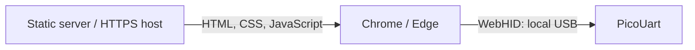

# Host Tools Development

This guide covers the Python and .NET host tools and their shared dashboard frontend. For installation and usage, see
the [Python package guide](../../host/python/README.md) and [.NET host guide](../../host/dotnet/README.md). The Python
package guide is also included as the PyPI project description.

The independent [WebHID prototype](../../host/webhid/README.md) runs directly in a supported desktop browser with its
own assets and renderer. Its hardware-free checks use Node rather than the Python/.NET test runners.

## Prerequisites

- Python 3.10 or newer for the Python host and cross-backend integration checks
- .NET 10 SDK for the C# host
- Desktop Chrome or Edge with WebHID support for the browser-only host
- Node 22 or newer for WebHID unit tests; no Node runtime is required to use a hosted page
- Bash on Linux/macOS, or PowerShell on Windows
- Network access to install hash-locked Python dependencies and restore .NET packages

## Python Environment Setup

From the repository root, the Bash helper creates `host/python/.venv`, installs the locked development dependencies, and
installs `pico-uart` in editable mode:

```bash
tools/host/setup-venv.sh
source host/python/.venv/bin/activate
```

On Windows PowerShell:

```powershell
.\tools\host\setup-venv.ps1
.\host\python\.venv\Scripts\Activate.ps1
```

Use `--venv-dir PATH` with Bash or `-VenvDir PATH` with PowerShell to choose a different location. Relative paths are
resolved from the current working directory. See [tools/README.md](../../tools/README.md) for the repository's host
setup helper entry points.

## Python Layout

- `src/pico_uart/client.py`: public HID client API
- `src/pico_uart/transport.py`: device discovery and HID transport
- `src/pico_uart/protocol.py`: HID report constants and decoders
- `src/pico_uart/cli.py`: command-line interface
- `src/pico_uart/web/`: Flask dashboard backend
- `../web/`: shared `index.html` with separate `css/` and `js/` folders, also served by the
  [.NET host](../../host/dotnet/README.md)
- `setup.py`: copies shared dashboard resources into wheels and source distributions
- `tests/`: package tests, shared fixtures, and report helpers

The CLI, dashboard, and tests should use the public `pico_uart` package rather than adding another top-level
compatibility module. Repository-level test layout and validation commands are in the
[firmware and repository testing guide](firmware-testing.md).

## Python Tests

Run all package and repository Python tests from the repository root:

```bash
host/python/.venv/bin/python -m pytest -c pyproject.toml
```

To run only the installable `pico-uart` package tests, run from `host/python`:

```bash
.venv/bin/python -m pytest -c pyproject.toml
```

On Windows, use `host/python/.venv/Scripts/python.exe` in place of the POSIX interpreter path. The pytest suite does not
require a board; hardware validation and acceptance criteria are documented in the [test index](../tests/README.md).

The repository-wide host test runner is `tools/validation/run-host-tests.sh`.

Measure package coverage from `host/python` with:

```bash
.venv/bin/python -m pytest --cov=pico_uart --cov-report=term-missing
```

## Python Dependencies and Locking

`requirements.txt` lists runtime dependencies. `requirements-dev.txt` adds the test runner. CI and release qualification
install `requirements-lock.txt` with hash verification. After changing direct dependencies, regenerate that lock from
the repository root with:

```bash
uv pip compile host/python/requirements-dev.txt --universal --python-version 3.10 \
  --generate-hashes --no-emit-index-url --output-file host/python/requirements-lock.txt
```

The existing [dependency contract test](../../tests/contracts/test_firmware_contract.py) checks that the direct pins
appear in the generated lock.

## Python Distribution

Build the wheel from the repository root:

```bash
uv build --wheel --directory host/python
```

The project metadata points PyPI at `host/python/README.md` for its long description. Keep that file focused on package
users; contributor setup and maintenance instructions belong in this guide.

## .NET Development

The solution in `host/dotnet/PicoUart.sln` contains the host application and its xUnit test project. From the repository
root:

```sh
dotnet build host/dotnet/PicoUart.sln
dotnet test host/dotnet/PicoUart.sln --filter "Category=Unit"
```

Unit tests run without a board. Cross-backend integration checks publish the .NET application and verify its shared
frontend and HTTP contract:

```sh
host/python/.venv/bin/python -m pytest tests/tooling/test_dotnet_host.py
```

These integration checks skip when `dotnet` is not on `PATH`; set `DOTNET_EXE` to another SDK executable if needed.
See the [.NET host guide](../../host/dotnet/README.md#publish) for publishing and standalone deployment.

## WebHID Development

WebHID is an independent, read-only browser dashboard in `host/webhid`. It uses neither the Python/.NET diagnostics
server nor their `host/web` frontend. Keep all WebHID HTML, styles, icons, rendering, and device code in its own folder;
do not introduce shared imports, asset-generation steps, or changes to `host/web` for this application. See the
[WebHID usage guide](../../host/webhid/README.md) for its supported browsers and deployment overview.

### Layout

- `host/webhid/index.html`: page structure and content security policy
- `host/webhid/favicon.svg`: browser page icon
- `host/webhid/css/dashboard.css`: WebHID-owned dashboard styling
- `host/webhid/css/webhid.css`: connection controls and device-detail styling
- `host/webhid/js/app.mjs`: page initialization, buttons, and connection-state rendering
- `host/webhid/js/device.mjs`: HID discovery, report decoding, connection ownership, and telemetry accounting
- `host/webhid/js/view.mjs`: summary and six-channel table rendering
- `host/webhid/tests/`: Node tests for standalone assets, report contracts, and connection lifecycle

There is no npm installation, bundler, preparation script, or generated asset folder. The directory can be served or
published as-is.

### Local Preview

From the repository root:

```sh
python3 -m http.server 8000 --bind 127.0.0.1 --directory host/webhid
```

Open `http://127.0.0.1:8000/`, not `/webhid/`. The document root is already `host/webhid`. On Windows, use `python`
instead of `python3` if that is the installed command. This server only serves static files; it does not open the Pico
or provide a diagnostics API. Python's host package and .NET are not required for this preview command.

Use HTTPS for a hosted deployment. Plain localhost HTTP is suitable for development; an ordinary HTTP LAN address
does not generally qualify as a secure context. Do not disable browser security checks or launch the HTML from disk.

### USB Access And Connection

The browser, not the static server, opens the HID interface:



Connect the Pico's USB data cable to the computer running Chrome or Edge. Click Connect, select the PicoUart HID
device, and confirm Chrome's chooser. Selection requires a user gesture; there is no password, hostname, or remote
USB address to enter. The client restricts selection to VID/PID `cafe:4010`, usage page `0xFF00`, usage `1`.

Connect reads MCU/clock, firmware/temperature, and overflow metadata. Input reports then update the six-channel health
and traffic table. Refresh rereads metadata; Disconnect closes the HID connection. Unplugging clears the last sample
and counters. Reconnect starts a new monitoring session, and late results from an old connection must not restore
stale values.

**A forwarded website is not a forwarded USB device.** With VS Code Remote, SSH, WSL, or another remote workspace,
Chrome still enumerates USB devices available to the browser's OS. If the board is attached to the Linux server while
Chrome runs on another PC, the WebHID chooser will have no matching device. Moving the USB cable to the browser's
computer or using a supported browser on the device-owning machine is required for direct WebHID access. For a board
that must remain remote, use the Python/.NET server dashboard instead; a configured port forward carries its HTTP API.

### Diagnostics Contract

The [HID report reference](../design/usb/hid-report-reference.md) defines the firmware wire contract:

| Report | Browser Operation | Dashboard Data |
| ------ | ----------------- | -------------- |
| `1` | `inputreport` event | Six-channel health, backend, CDC-open state, ring peak, traffic, and sequence |
| `3` | `receiveFeatureReport(3)` | Firmware version and board temperature |
| `5` | `receiveFeatureReport(5)` | Per-channel RX overflow counts |
| `6` | `receiveFeatureReport(6)` | MCU name/raw ID and SDK-reported system clock |

Input event data excludes the report-ID byte; `event.reportId` carries it separately. Chromium's numbered feature
responses include the ID prefix and may contain zero platform padding. Keep these framing rules distinct in decoders.
Validate report sizes, layout versions, flags, and nonzero clock values before displaying data.

Unknown MCU IDs retain their numeric ID and clock and display as `Unknown MCU (ID)`. Firmware without report 6 can
still provide the other diagnostics. Failed metadata reads clear the affected values rather than displaying stale
data. Traffic totals are observed lower bounds: missed sequences and saturated deltas set the incomplete indicator.

This dashboard does not send board-control reports, change clocks, configure UART line coding, or carry UART bytes.
WebSerial and LED/reset controls are not implemented. MCU/clock display requires compatible firmware; merely serving
a newer page does not update firmware on the board.

### Troubleshooting

- **Connect disabled:** check WebHID browser support and HTTPS/localhost secure-context requirements. Firefox, Safari,
  and mobile browsers generally do not support this API.
- **No compatible devices found:** check the physical USB location first, then the data cable, OS device enumeration,
  running firmware, and device identity. Entering `localhost` in a chooser cannot select a remote board.
- **Device cannot be opened:** check site permissions, OS HID access, and competing host tools. Linux may require
  hidraw access rules; administrative approval belongs in the OS, never in this page.
- **Connected but some fields unavailable:** inspect the displayed report error and firmware compatibility. Refresh
  retries metadata reads; unsupported report 6 does not invalidate the remaining diagnostics.
- **No live channel samples:** close competing HID readers and verify the firmware publishes input report 1. Browser
  permission to open a device is not proof that telemetry has arrived.

### Checks

From the repository root:

```sh
node --test host/webhid/tests/*.test.mjs
node --check host/webhid/js/app.mjs
node --check host/webhid/js/device.mjs
node --check host/webhid/js/view.mjs
```

The Node suite uses mocked devices and needs no physical board. It covers root-local asset references, report framing,
unknown IDs, chooser cancellation, read errors, unplug/close races, sequence wrap/gaps, and traffic accounting. The
host-validation workflow runs the WebHID checks separately from Python/.NET tests.

For a real browser check, connect a compatible board to that browser's machine, select it through the native chooser,
verify MCU/clock and all six channels, exercise Refresh/Disconnect, and unplug/reconnect. Confirm that stale data
clears and that both desktop and narrow layouts remain readable. Record the browser/OS, board, firmware, and result;
mocked browser tests alone do not establish native USB compatibility or replace the [HIL workflow](../tests/README.md).

## Python/.NET Web UI

Edit the frontend once under `host/web`: `index.html`, `favicon.svg`, `css/`, and `js/`. Both backends serve those same
files and fill the HTML's `{{ csrf_token }}` placeholder. Keep templates backend-neutral and preserve the shared JSON
field names. The [.NET integration tests](../../tests/tooling/test_dotnet_host.py) check canonical frontend bytes.

Editable installs load `host/web` directly. Distribution builds bundle those same resources under
`pico_uart/web/assets`; source archives include them so wheels can be rebuilt without the repository. Run
`uv build --directory host/python` to check the source-archive-to-wheel path as well as the direct wheel build. .NET
build and publish copy the shared files into the application's output directory.
