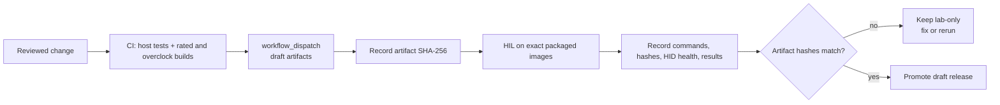

# Releasing PicoUart

Release tags run [`.github/workflows/release.yml`](../.github/workflows/release.yml), which builds and packages firmware,
runs host validation, and opens a **draft** GitHub Release. The workflow and
[firmware build guide](../firmware/build-and-config.md) define the current board matrix, clocks, and artifact names.
The promote HIL gate covers the rated images.

Do not publish the draft until exact-artifact hardware-in-the-loop (HIL) evidence passes the gates below.

A `workflow_dispatch` run creates artifacts for preflight HIL; a release tag creates the draft to promote.



The release unit is the exact packaged artifact, not a source revision or a local rebuild. HIL evidence is valid only
when its image hash matches the artifact attached to the draft release.

## Release Preflight

Before requesting HIL, confirm:

1. The change is reviewed and the working tree contains no unintended files.
2. The version follows the [release tag policy](#versioning).
3. Host validation and all required target builds pass in the release workflow.
4. `git diff --check` passes.
5. Release notes identify USB/HID compatibility or behavior changes.

Do not begin physical testing from an uncommitted or locally modified image.

## Security Reporting Setup

Before publishing, enable private vulnerability reporting in repository settings and handle reports privately. User
instructions and device-security notes are in [`SECURITY.md`](../SECURITY.md).

## USB identity

PicoUart artifacts use `cafe:4010`, an unallocated lab identity. Do not reuse it commercially; derivatives need an
allocated VID/PID and must treat the identity change as a breaking USB change. See [`SECURITY.md`](../SECURITY.md) and
the USB identity contract tests before publishing.

## Release HIL Gates

Use the [Test Documentation Index](tests/README.md) for automated validation, HIL sequence, and result semantics. CI
validates builds and host tests; it cannot establish physical qualification.

Release promotion follows the measured six-port envelope in the
[HIL test plan](tests/hil-fixture-test-plan.md#measured-six-port-envelope). Rates inside that envelope must pass. A stop
at the plan's documented first-failed rate is the expected ceiling for that image. Run HIL on the exact packaged UF2/ELF
and verify its SHA-256 against the draft; a local rebuild or a result for another artifact does not qualify the
release. Overclock results apply only to the matching artifact and do not establish general stability or operating
margins.

Follow the [HIL fixture setup](tests/hil-fixture-setup.md) and [test plan](tests/hil-fixture-test-plan.md) for required
phases and acceptance criteria. Preserve per-board records using the [HIL record format](tests/records/README.md), with
artifact hashes and any failures or partial conditions. Without matching recorded evidence, the release remains lab-only.

## Flashing Release Artifacts

Flash with the packaged ELF/UF2 and skip rebuilding:

```sh
tools/firmware/load.sh --board <pico|pico2> --skip-build --elf <path-to-release.elf>
```

Use `--probe-serial <serial>` when more than one CMSIS-DAP probe is attached or when USB enumeration tools are
unavailable.

Use a current OpenOCD CMSIS-DAP build. If OpenOCD reports `Unknown flash device` after detecting the SWD target, update
OpenOCD and retry with `--adapter-speed-khz 1000` before treating the HIL attempt as firmware failure. Flash ID
`0x00154068` is a Boya BY25Q16ES device; older OpenOCD builds may need an upstream binary selected with `--openocd-exe`.

### Override QSPI Auto-Detection (Advanced)

Only use this recovery when SWD communication is stable and the exact QSPI flash capacity has been confirmed from the
chip marking and its datasheet. Do not guess the capacity: OpenOCD uses it to define erase bounds, so a wrong value can
make flash operations unsafe. Prefer a current OpenOCD build and normal JEDEC/SFDP detection whenever possible.

The OpenOCD RP2040/RP2350 target scripts accept a nonzero `FLASHSIZE` in bytes to skip QSPI JEDEC/SFDP auto-detection.
Create a temporary target config that sets the verified capacity before sourcing the board target:

```sh
FLASH_SIZE_BYTES=<confirmed-capacity-in-bytes>
OPENOCD_TARGET_CFG="$(mktemp)"
trap 'rm -f "$OPENOCD_TARGET_CFG"' EXIT
printf 'set FLASHSIZE %s\nsource [find target/rp2040.cfg]\n' "$FLASH_SIZE_BYTES" > "$OPENOCD_TARGET_CFG"
tools/firmware/load.sh --board pico --skip-build --elf <path-to-pico.elf> \
   --openocd-target "$OPENOCD_TARGET_CFG" --probe-serial <probe-serial> --adapter-speed-khz 1000
```

For Pico 2, use `--board pico2`, a Pico 2 ELF, and replace the target in the temporary config with
`target/rp2350.cfg`. Continue only if OpenOCD reports **Verified OK**. This override skips flash identification; it does
not recover failed SWD access, repair reset/wiring, or prove the selected capacity is correct.

## Required HIL Matrix

Follow the [board-testing skill](../.github/skills/pico-uart-board-testing/SKILL.md), [fixture setup](tests/hil-fixture-setup.md),
and [HIL test plan](tests/hil-fixture-test-plan.md) for the current required test matrix. Inside the measured envelope,
promotion requires no unexplained data loss, timeout, USB disconnect, or relevant HID error.

## Optional Claims

Run optional tests only when the release notes claim the behavior:

- Backpressure and hardware/PIO RTS/CTS require the matching board configuration and HIL variants described in the
   [fixture test plan](tests/hil-fixture-test-plan.md).

## Promote checklist (draft → published)

Before publishing, verify the draft hashes match complete HIL records for all rated targets, link those records, and
include any USB identity or HID compatibility notes in the release notes. Release CI must pass its reviewed dependency
lock and build gates.

## Versioning

Tags use plain `vMAJOR.MINOR.PATCH` with no pre-release suffix. The release version resolver owns tag bounds; firmware
build limits may differ. Firmware reports the semantic version over HID and major/minor in `bcdDevice`; see the
[HID Report Reference](design/usb/hid-report-reference.md) for encoding details. Release workflows own the SDK and
toolchain pins and install the reviewed, hash-locked Python requirements.
