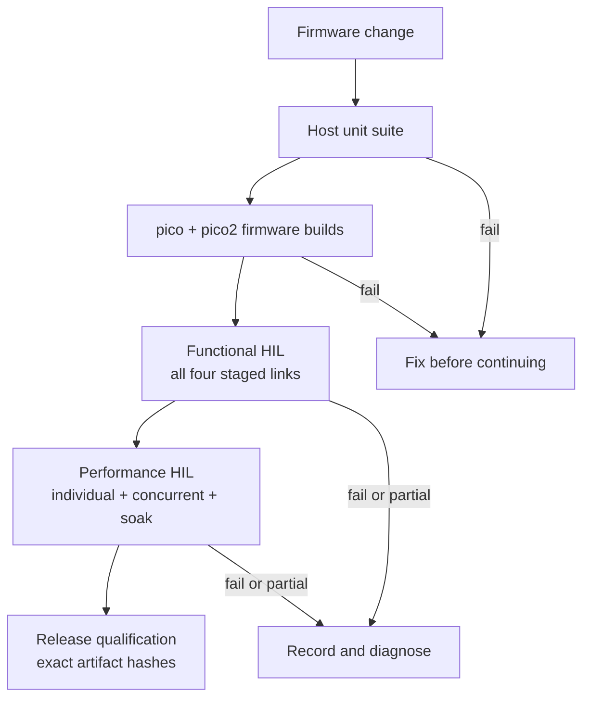

# Test Documentation

This directory separates automated validation from physical hardware
qualification. Use the smallest applicable level first and do not treat a
partial hardware run as a full pass.

## Test Levels



| Level | Environment | Primary purpose | Result authority |
| --- | --- | --- | --- |
| Host tests | Native host | Pure policies, rings, claims, controls, adapter contract, facade guards | `ctest` result |
| Firmware build | Pico SDK/toolchain | Compile/link both RP2040 and RP2350 targets | Build artifacts |
| Functional HIL | Board + fixed four-link fixture | Enumeration, bidirectional bytes, backend mapping, HID health | Functional result entry |
| Performance HIL | Same fixture | Throughput, integrity, concurrency, soak, overflow behavior | Performance result entry |
| Release HIL | Exact packaged artifacts | Qualification of artifacts intended for publication | Release checklist + hashes |

## Automated Validation

From the repository root:

```sh
tools/test/test-host.sh
ctest --test-dir build/host-tests --output-on-failure
tools/firmware/build.sh --board pico
tools/firmware/build.sh --board pico2
git diff --check
```

The host suite is not a hardware test. It does not prove DMA timing, USB
enumeration, multicore scheduling under load, physical UART signaling, or
RTS/CTS behavior.

## Hardware Test Sequence

1. Follow [Self-Test Setup](self-test-setup.md) and install all four links before testing.
2. Run the [Functional Test Plan](functional-test-plan.md).
3. Run the [Performance Test Plan](performance-test-plan.md) only after functional checks pass.
4. Record every run in [Performance Test Results](performance-test-results.md).
5. For releases, use the exact packaged artifacts and follow [Releasing](../releasing.md).

## Result Semantics

- `PASS`: every required case for the declared test level passed.
- `FAIL`: a required case failed or produced unexplained loss/error.
- `PARTIAL`: a case, link, board, or required artifact was intentionally omitted.

A `PARTIAL` result is useful diagnostic evidence, but it cannot qualify the
full six-port design or a release.

## Evidence Minimum

Every hardware result should identify:

- board target and physical board
- firmware version, source commit, artifact name, and SHA-256 when available
- test command and duration/rates
- wiring variant and RTS/CTS configuration
- per-link result and verified byte integrity
- HID health and overflow deltas
- USB resets, disconnects, framing errors, or control errors
- raw transcript path when output is too large for the result entry
