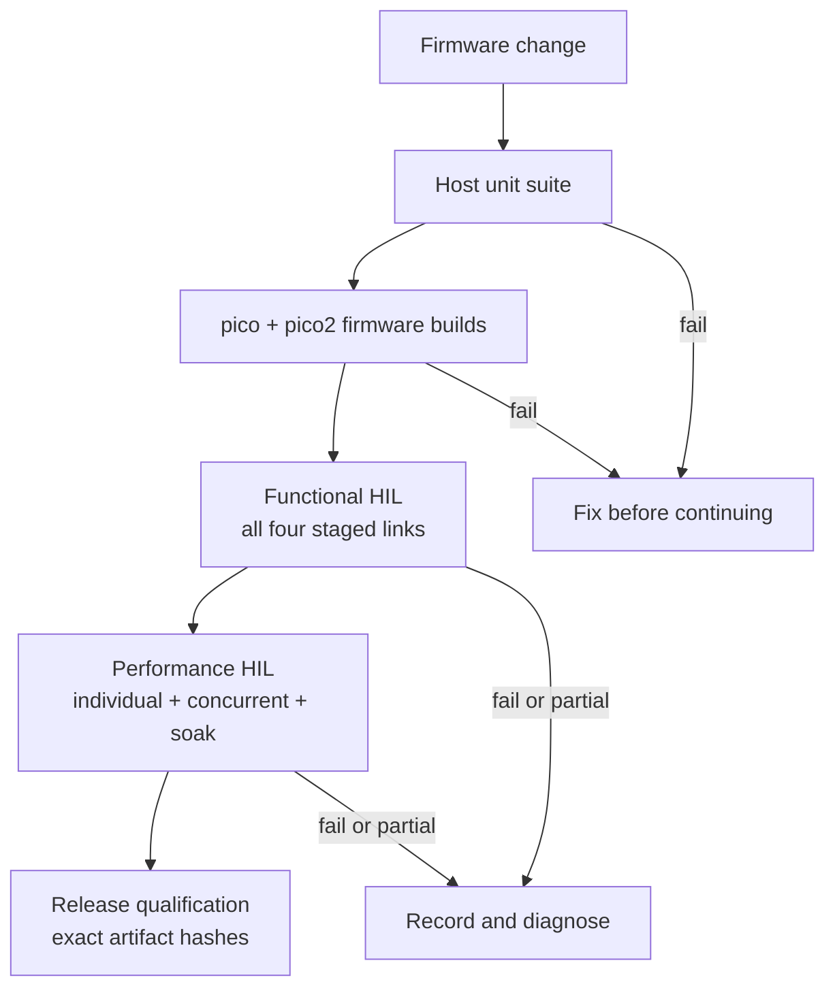

# Test Documentation

This directory separates automated validation from physical hardware qualification. Use the smallest applicable level
first and do not treat a partial hardware run as a full pass.

## Test Levels


```mermaid
flowchart TD
    Change["Firmware change"] --> Host["Host unit suite"]
    Host --> Build["pico + pico2 firmware builds"]
    Build --> Functional["Functional HIL\nall four staged links"]
    Functional --> Performance["Performance HIL\nindividual + concurrent + soak"]
    Performance --> Release["Release qualification\nexact artifact hashes"]
    Host -->|fail| Fix["Fix before continuing"]
    Build -->|fail| Fix
    Functional -->|fail or partial| Diagnose["Record and diagnose"]
    Performance -->|fail or partial| Diagnose
```

| Level           | Environment                     | Primary purpose                                                         | Result authority           |
| --------------- | ------------------------------- | ----------------------------------------------------------------------- | -------------------------- |
| Host tests      | Native host                     | Pure policies, rings, claims, controls, adapter contract, facade guards | `ctest` result             |
| Firmware build  | Pico SDK/toolchain              | Compile/link both RP2040 and RP2350 targets                             | Build artifacts            |
| Functional HIL  | Board + fixed four-link fixture | Enumeration, bidirectional bytes, backend mapping, HID health           | Functional result entry    |
| Performance HIL | Same fixture                    | Throughput, integrity, concurrency, soak, overflow behavior             | Performance result entry   |
| Release HIL     | Exact packaged artifacts        | Qualification of artifacts intended for publication                     | Release checklist + hashes |

## Automated Validation

From the repository root:

```sh
tools/validation/run-host-tests.sh
ctest --test-dir build/host-tests --output-on-failure
tools/firmware/build.sh --board pico
tools/firmware/build.sh --board pico2
git diff --check
```

The host suite is not a hardware test. It does not prove DMA timing, USB enumeration, multicore scheduling under load,
physical UART signaling, or RTS/CTS behavior.

## Hardware Test Sequence

1. Follow [HIL Fixture Setup](hil-fixture-setup.md) and install both crossed pairs and both loopbacks before testing.
2. Follow the [HIL Fixture Test Plan](hil-fixture-test-plan.md), which runs functional checks before performance.
3. The combined runner creates a dated record in [records](records/README.md); standalone phase runners log locally to
   `build/hil-results.md`.
4. For releases, use the exact packaged artifacts and follow [Releasing](../releasing.md).

From the repository root, run the combined functional and concurrent-performance checks and generate a dated result:

```sh
tools/hil/runner/full.sh \
    --pico-cdc0 /dev/serial/by-id/<pico-cdc0> \
    --pico-cdc1 /dev/serial/by-id/<pico-cdc1> \
    --pico-cdc2 /dev/serial/by-id/<pico-cdc2> \
    --pico-cdc3 /dev/serial/by-id/<pico-cdc3> \
    --pico-cdc4 /dev/serial/by-id/<pico-cdc4> \
    --pico-cdc5 /dev/serial/by-id/<pico-cdc5> \
    --board pico --firmware-version 1.2.3 --firmware-commit <commit> \
    --artifact /path/to/flashed/pico_uart.uf2 \
    --rates 460800,500000,600000 --duration 30
```

Replace the example values with the attached board's endpoints and firmware metadata. The runner creates
`docs/tests/records/` if needed and avoids overwriting earlier records. This command records the functional and
concurrent six-port phases; use the [HIL Fixture Test Plan](hil-fixture-test-plan.md) for the separate pair sweeps and
soak checks.

## Result Semantics

- `PASS`: every required case for the declared test level passed.
- `FAIL`: a required case failed or produced unexplained loss/error.
- `PARTIAL`: a case, link, board, or required artifact was intentionally omitted.

A `PARTIAL` result is useful diagnostic evidence, but it cannot qualify the full six-port design or a release.

## Evidence Minimum

Every hardware result should identify:

- board target and physical board
- firmware version, source commit, artifact name, and SHA-256 when available
- test command and duration/rates
- wiring variant and RTS/CTS configuration
- per-link result and verified byte integrity
- HID health and overflow deltas
- USB resets, disconnects, framing errors, or control errors
- relevant measurements, caveats, and exact artifact hashes in the result entry
