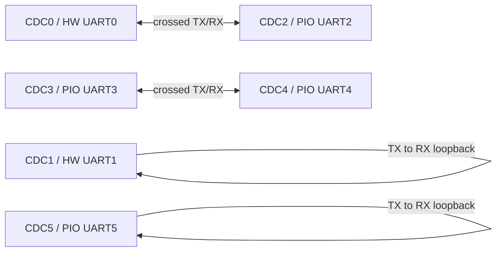

# HIL Fixture Setup

This is the canonical physical fixture for the functional and performance HIL plans. See the
[Test Documentation Index](README.md) for the complete test sequence.

It validates all six PicoUart channels through two crossed UART pairs and two local loopbacks. Install all four links
before testing and do not change wiring during a run.

Use this document once during physical setup. After the fixture is installed, follow the
[HIL Fixture Test Plan](hil-fixture-test-plan.md) without moving jumpers.



The USB CDC numbers identify host-facing interfaces, not GPIO numbers. Cross TX and RX for paired ports; connect TX to
RX on the same port for each loopback.

The USB host sees the channels as CDC0 through CDC5:

| USB CDC | UART  | Backend       | TX   | RX   |
| ------- | ----- | ------------- | ---- | ---- |
| CDC0    | UART0 | Hardware UART | GP0  | GP1  |
| CDC1    | UART1 | Hardware UART | GP4  | GP5  |
| CDC2    | UART2 | PIO UART      | GP8  | GP9  |
| CDC3    | UART3 | PIO UART      | GP12 | GP13 |
| CDC4    | UART4 | PIO UART      | GP16 | GP17 |
| CDC5    | UART5 | PIO UART      | GP20 | GP21 |

All connections use 3.3 V UART logic and share ground with the PicoUart board. The firmware defaults to 115200 baud, 8
data bits, no parity, and 1 stop bit (8N1). RTS/CTS is disabled for this setup; leave those pins disconnected unless you
are running an explicit flow-control variant.

## Equipment

- PicoUart board with a flashed Pico or Pico 2
- USB data cable from the PicoUart board to the host
- Jumper wires
- Host computer with the PicoUart host tools installed

## Electrical Safety

- Use 3.3 V UART logic only.
- Connect a shared ground for every link.
- Never connect UART TX to TX or RX to RX.
- Never connect RS-232 voltage levels directly to Pico GPIOs.
- Leave RTS/CTS disconnected for the baseline fixture.
- Power the board through its intended USB connection; do not add an external UART voltage source to signal pins.

## Fixed Fixture Wiring

Install these four links before starting a runner. Do not move jumpers between stages.

### Link 1: Hardware UART0 to PIO UART2

Cross the signal directions between UART0/CDC0 and UART2/CDC2:

| UART0 signal | GPIO | UART2 signal | GPIO |
| ------------ | ---- | ------------ | ---- |
| TX           | GP0  | RX           | GP9  |
| RX           | GP1  | TX           | GP8  |
| GND          | GND  | GND          | GND  |

### Link 2: PIO UART3 to PIO UART4

Cross the signal directions between UART3/CDC3 and UART4/CDC4:

| UART3 signal | GPIO | UART4 signal | GPIO |
| ------------ | ---- | ------------ | ---- |
| TX           | GP12 | RX           | GP17 |
| RX           | GP13 | TX           | GP16 |
| GND          | GND  | GND          | GND  |

### Link 3: Hardware UART1 Loopback

Connect UART1/CDC1 TX to its own RX:

| PicoUart signal | GPIO | PicoUart signal | GPIO |
| --------------- | ---- | --------------- | ---- |
| TX              | GP4  | RX              | GP5  |

### Link 4: PIO UART5 Loopback

Connect UART5/CDC5 TX to its own RX:

| PicoUart signal | GPIO | PicoUart signal | GPIO |
| --------------- | ---- | --------------- | ---- |
| TX              | GP20 | RX              | GP21 |

## Bring-Up Checklist

1. Flash the intended firmware artifact and record its version and SHA-256.
2. Connect the PicoUart USB device and confirm that CDC0 through CDC5 plus HID enumerate. Prefer stable paths under
   `/dev/serial/by-id` instead of `/dev/ttyACM*`.
3. Run a continuity check against the four link tables below: TX crosses to RX, RX crosses to TX, and every link has a
   common ground.
4. Confirm all four links are installed before starting the full test.
5. Run the functional and performance plans without changing wiring.
6. Remove all test jumpers before connecting external UART equipment.

## Endpoint Preflight

Before running a test runner, record the stable device paths:

```sh
ls -l /dev/serial/by-id/
```

Expected endpoints are six PicoUart CDC serial ports. The HID interface may not appear as a serial path; verify it with
the HID host tool or the runner's enumeration step. Do not guess interface numbers from `/dev/ttyACM*` ordering when
stable by-id paths are available.

Stop the test and inspect the wiring if a channel fails in both directions, a CDC interface disappears, the board resets
unexpectedly, or a signal appears to be at the wrong voltage.

For flashing, USB enumeration, and extended stress testing, see the [HIL Fixture Test Plan](hil-fixture-test-plan.md)
and the board-testing procedure in the repository skill documentation.

## Optional Manual External-Peer Check

A Debug Probe UART connection may be tested manually as an external peer, but it is not part of this HIL fixture or its
pass criteria. Connect one PicoUart port to the probe and run:

```sh
tools/hil/runner/bridge.sh \
   --pico-port /dev/serial/by-id/<pico-cdc-endpoint> \
   --peer-port /dev/serial/by-id/<debug-probe-uart> \
   --label manual-debug-probe --baud 115200
```
