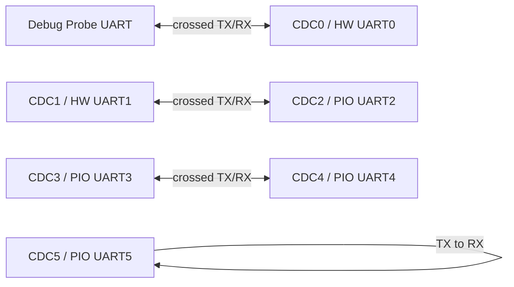

# Self-Test Setup

This setup is used by the functional and performance HIL plans. See the [Test
Documentation Index](README.md) for the complete test sequence.

This procedure validates all six PicoUart channels with four independent links
installed at the same time. Do not change wiring during the test. Verify the
complete fixture before starting the runner.

Use this document once during physical setup. After the fixture is installed,
run the [Functional Test Plan](functional-test-plan.md), then the
[Performance Test Plan](performance-test-plan.md) without moving jumpers.



All four links are independent. The USB CDC numbers identify the host-facing
interfaces; they are not GPIO numbers.

The USB host sees the channels as CDC0 through CDC5:

| USB CDC | UART | Backend | TX | RX |
| --- | --- | --- | --- | --- |
| CDC0 | UART0 | Hardware UART | GP0 | GP1 |
| CDC1 | UART1 | Hardware UART | GP4 | GP5 |
| CDC2 | UART2 | PIO UART | GP8 | GP9 |
| CDC3 | UART3 | PIO UART | GP12 | GP13 |
| CDC4 | UART4 | PIO UART | GP16 | GP17 |
| CDC5 | UART5 | PIO UART | GP20 | GP21 |

All connections use 3.3 V UART logic. Share ground between the Debug Probe and
the PicoUart board. The firmware defaults to 115200 baud, 8 data bits, no
parity, and 1 stop bit (8N1). RTS/CTS is disabled for this setup; leave those
pins disconnected unless you are running an explicit flow-control variant.

## Equipment

- PicoUart board with a flashed Pico or Pico 2
- Raspberry Pi Debug Probe with its UART interface
- USB data cable from the PicoUart board to the host
- Jumper wires
- Host computer with the PicoUart host tools installed

## Electrical Safety

- Use 3.3 V UART logic only.
- Connect a shared ground for every link, including the Debug Probe.
- Never connect UART TX to TX or RX to RX.
- Never connect RS-232 voltage levels directly to Pico GPIOs.
- Leave RTS/CTS disconnected for the baseline fixture.
- Power the board through the intended USB/debug setup; do not add an external
   UART voltage source to the signal pins.

The Debug Probe SWD connection is only needed for flashing and debugging. Its
UART connection is used as the external peer in stage 1.

## Fixed Fixture Wiring

Install all four links before starting the runner. Do not move jumpers between
stages.

### Link 1: Debug Probe to Hardware UART

Use UART0/CDC0. Cross the signal directions:

| PicoUart UART0 | GPIO | Debug Probe UART |
| --- | --- | --- |
| TX | GP0 | RX |
| RX | GP1 | TX |
| GND | GND | GND |

### Link 2: Hardware UART to PIO UART

Connect hardware UART1/CDC1 to PIO UART2/CDC2, crossing TX and RX:

| UART1 signal | GPIO | UART2 signal | GPIO |
| --- | --- | --- | --- |
| TX | GP4 | RX | GP9 |
| RX | GP5 | TX | GP8 |
| GND | GND | GND | GND |

### Link 3: PIO UART to PIO UART

Connect PIO UART3/CDC3 to PIO UART4/CDC4:

| UART3 signal | GPIO | UART4 signal | GPIO |
| --- | --- | --- | --- |
| TX | GP12 | RX | GP17 |
| RX | GP13 | TX | GP16 |
| GND | GND | GND | GND |

### Link 4: PIO UART Loopback

Loop back PIO UART5/CDC5 by connecting its TX to its RX:

| PicoUart signal | GPIO | PicoUart signal | GPIO |
| --- | --- | --- | --- |
| TX | GP20 | RX | GP21 |

## Bring-Up Checklist

1. Flash the intended firmware artifact and record its version and SHA-256.
2. Connect the PicoUart USB device and confirm that CDC0 through CDC5 plus HID
   enumerate. Prefer stable paths under
   `/dev/serial/by-id` instead of `/dev/ttyACM*`.
3. Confirm the Debug Probe UART endpoint also appears under
   `/dev/serial/by-id`.
4. Run a continuity check against the four link tables below: TX crosses to RX,
   RX crosses to TX, and every link has a common ground.
5. Confirm all four links are installed before starting the full test.
6. Run the functional and performance plans without changing wiring.
7. Remove all test jumpers before connecting external UART equipment.

## Endpoint Preflight

Before running a test runner, record the stable device paths:

```sh
ls -l /dev/serial/by-id/
```

Expected endpoints are one Debug Probe UART and six PicoUart CDC serial ports.
The HID interface may not appear as a serial path; verify it with the HID host
tool or the runner's enumeration step. Do not guess interface numbers from
`/dev/ttyACM*` ordering when stable by-id paths are available.

Stop the test and inspect the wiring if a channel fails in both directions, a
CDC interface disappears, the board resets unexpectedly, or a signal appears
to be at the wrong voltage.

For flashing, USB enumeration, and extended stress testing, see the
[Functional Test Plan](functional-test-plan.md),
[Performance Test Plan](performance-test-plan.md), and the board-testing
procedure in the repository skill documentation.